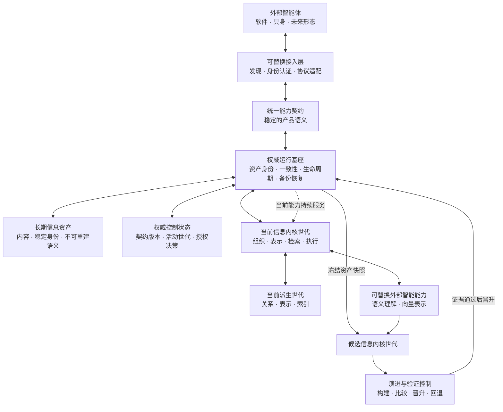

# 顶层架构设计草案

> 状态：草案。本文从产品需求重新推导完整目标架构；确认封版后，以其重写《架构总纲》。现有实现只作为可继承资产和问题证据，不限制目标设计。本次范围仅为架构基座优化，不设计或实现新的产品功能，也不迭代当前稳定内核；未来能力只用于检验架构是否保留正确扩展边界。

## 一、架构结论

Ownward 采用**权威基座—能力世代架构**：

> **资产永久、契约稳定、实现可替换、候选按世代演进、所有接入共享同一权威。**

体系不追求“一切都能运行时热插拔”。真正需要的是：当前有效能力持续可用，新实现能够在不改变用户信息的前提下独立建立、验证、晋升、回退；模型、信息内核、存储实现和接入形态分别拥有清晰的替换边界。

稳定的不是某个代码仓库、进程或技术栈，而是用户信息的归属、身份、含义、核心能力语义和替换规则。具体实现必须能够持续推翻和升级。

## 二、第一性原理

1. **个人信息比任何实现活得更久**：智能体、模型、算法、设备、协议和产品代码都会被替换，用户信息不能随它们迁移含义或失去可用性。
2. **产品只有一个信息权威**：一个用户只维护一份活动信息体系；多个智能体、接入方式和能力实现不能形成平行真相。
3. **质量能力必须持续演进**：组织与检索是产品价值核心，旧内核保持服务，新内核必须能够脱离旧实现独立竞争并只凭更优证据晋升。
4. **可替换不等于插件化一切**：替换边界来自职责、状态和生命周期，不来自动态加载框架。没有独立状态边界和验收边界的“插件”只是换一种耦合。
5. **接入形式不是产品核心**：现在和未来的智能体使用同一产品能力；任何协议、SDK 或设备适配都只是可替换入口。
6. **架构不能以牺牲效率换取整洁**：边界首先是代码与状态所有权边界；没有隔离需求时保持进程内直接调用，只有资源、故障或部署证据要求时才跨进程。

## 三、参考架构判断

[DeepSeek Harness 的 Cordis 架构](https://github.com/deepseek-ai/deepseek-harness/blob/master/docs/architecture.md) 展示了三件有价值的事：能力可以通过稳定服务边界替换；依赖可以显式声明；组件的加载和卸载可以拥有完整生命周期。

Ownward 不照搬“一切皆插件”。Harness 管理的是可组合的智能体能力，Ownward 管理的是用户终身持有的信息权威。任意组件不能获得改写资产、绕过一致性或改变产品语义的权力。我们借鉴**明确能力边界、显式依赖和可逆生命周期**，不引入当前不需要的热重载、插件市场或通用扩展框架。

## 四、总体结构



这是一个窄腰结构：上方可以出现任意智能体和接入形式，下方可以出现任意内核、模型和存储实现；中间只有一套稳定的产品能力语义和一份权威信息资产。

## 五、职责与权力边界

| 部分           | 唯一职责                                                         | 明确不得承担                                                   |
| -------------- | ---------------------------------------------------------------- | -------------------------------------------------------------- |
| 长期信息资产   | 保存用户接受的信息、稳定身份、明确语义和必要来源                 | 保存模型、索引、算法私有状态或接入方临时状态                   |
| 权威控制状态   | 保存契约版本、当前能力选择及已经成立的产品授权决策               | 保存个人信息内容、可重建派生状态或算法私有配置                 |
| 权威运行基座   | 维护资产身份、版本、一致性、授权策略、备份恢复及能力世代生命周期 | 实现具体组织、检索、模型推理或外部协议                         |
| 信息内核世代   | 把资产转化为高质量组织和检索能力，对质量、时效和资源负责         | 改变资产原意、拥有接入身份或成为资产唯一解释者                 |
| 派生世代       | 保存当前内核可重建的关系、表示和索引                             | 成为信息权威或承载不可重建语义                                 |
| 外部智能能力   | 提供开放内容理解和语义表示                                       | 直接写资产、决定组织权威或拥有用户信息体系                     |
| 统一能力契约   | 稳定表达检索、读取、创建、更新、语义协作和规则获取               | 暴露内部存储、算法、模型或部署方式                             |
| 接入层         | 完成智能体发现、连接、身份认证和协议映射，并向内传递已认证主体   | 自行决定产品授权、保存私有真相、绕过能力契约或复制核心业务逻辑 |
| 演进与验证控制 | 识别候选直接依赖，生成证据，决定晋升与回退                       | 进入线上请求主链路或用仓库状态代替制品身份                     |

权威运行基座不是永远不可升级的二进制；它可以随产品升级替换，但不能被当作任意运行时插件。任何升级都必须继续理解既有资产并保持上述权力边界。

## 六、可替换能力模型

### 6.1 信息内核是完整可替换世代

一个信息内核世代由组织、表示、检索、派生存储和执行能力的确定组合构成。内部能力可以独立演进，但线上只使用经过整体验证的一致组合，不在运行中临时拼接未经共同验证的新旧部件。

本次架构迁移必须把当前稳定内核原样封装为第一内核世代。允许修改与权威基座接壤的端口、适配、装配和状态迁移代码，但不得借机改变内核的组织、表示、检索、排序、模型使用、索引语义、执行资源预算或退化行为；迁移前后的可观察行为必须等价，质量与时效不得退化。任何差异都属于架构迁移缺陷，不能作为内核优化接受。

内核效果演进只能在架构迁移完成后作为独立任务，通过新候选世代进行；不得把架构重构和内核迭代混为同一个候选。

新内核基于冻结的资产快照建立自己的派生世代，不修改当前派生状态。候选通过质量、时效、资源、资产不变量和故障恢复验证后，权威基座只切换当前内核世代指针；失败或退化时继续使用上一世代。

因此，开发 V2 不需要修改或重测 V1；只有 V2 证据成立并准备晋升时，才验证切换关系。项目文档、接入适配或无关模块变化也不能使既有内核证据失效。

### 6.2 每类能力拥有自己的替换边界

| 能力             | 替换后的状态影响                         | 必要证明                                     |
| ---------------- | ---------------------------------------- | -------------------------------------------- |
| 接入形态         | 不改变资产、内核和派生世代               | 能力契约、身份权限和端到端接入成立           |
| 外部语义能力     | 既有资产不变；受其产生的派生理解可以重算 | 输入输出契约、来源、不确定性和组织质量成立   |
| 向量模型与空间   | 既有资产不变；建立新的向量派生世代       | 空间一致性、检索质量、时效和资源成立         |
| 组织能力         | 既有资产不变；建立新的组织派生世代       | 语义保持、关系质量、增量一致性和检索增益成立 |
| 检索能力         | 既有资产不变；索引和编排可以整体替换     | 质量、时效、资源及各任务类型均成立           |
| 派生存储实现     | 只迁移或重建可派生状态                   | 完整性、恢复、切换和资源成立                 |
| 长期资产存储实现 | 迁移权威资产，风险最高                   | 身份、内容、不可重建语义和恢复结果完全一致   |
| 完整信息内核     | 旧内核与旧派生世代继续有效，候选旁路建立 | 全部内核能力、大版本跃升和无退化成立         |

可替换性必须通过“旧能力仍有效—新能力独立准备—证据通过—受控切换—可回退”的完整生命周期证明，不能仅凭接口存在或构造函数可注入宣称成立。

### 6.3 不要求热插拔

Ownward 的目标是无损替换，不是不中断地执行任意代码热替换。切换可以发生在明确的安全边界，并允许短暂、可控的服务交接；绝不能为了“零秒切换”引入双写、多份权威或无法证明的一致性复杂度。

## 七、组合与依赖规则

1. 所有可变实现只依赖稳定能力端口，不导入其他可变实现的具体类型。
2. 系统只有一个装配入口，根据经过校验的组合清单建立当前产品；构造函数不能用隐含默认值切换产品语义。
3. 接入层只能调用统一能力契约，不能直接访问资产、派生存储或模型。
4. 信息内核只能通过资产端口读取权威信息，通过派生端口管理自己的世代，通过智能能力端口取得外部能力。
5. 外部智能能力的输出必须携带能力身份、输入身份和来源，不能作为无来源事实进入派生状态。
6. 具体组件优先保持同一进程内的强类型调用；独立进程只用于模型运行、故障隔离或跨设备接入等具有明确价值的场景。
7. 组件替换不能要求用户修改个人信息，也不能要求外部智能体重新理解 Ownward 的产品语义。
8. 稳定契约必须显式版本化；兼容变化保持旧调用方可用，破坏性变化以新版本并存并经过迁移，不能让适配器猜测当前语义。
9. 每个内核世代必须声明所支持的资产契约、能力契约、智能能力和派生格式；装配前机械拒绝不兼容组合。

## 八、状态与生命周期

### 8.1 四类状态

| 状态         | 归属                     | 生命周期                                               |
| ------------ | ------------------------ | ------------------------------------------------------ |
| 长期信息资产 | 用户                     | 跨越所有内核、模型、接入和设备长期存在                 |
| 权威控制状态 | 权威运行基座             | 随契约和能力世代显式迁移，不随进程丢失                 |
| 能力派生世代 | 确定的信息内核或模型世代 | 可并存、验证、晋升、回退和回收                         |
| 运行状态     | 当前进程与当前请求       | 可丢弃，不承载唯一事实                                 |

任何新状态必须先被归入其中一类；无法归类说明职责边界仍然错误。

权威控制状态必须保持最小，只保存无法从资产和装配清单安全推导的产品决定。它不能承载个人信息内容或算法私有状态；即使控制状态损坏，长期信息资产仍必须能够独立识别和恢复。

### 8.2 替换方式由状态决定

- **无状态能力**：候选先通过契约与集成验证，再在安全边界切换调用；观察成立前保留旧实现，不迁移不存在的状态。
- **派生状态能力**：候选拥有独立派生世代，按资产基线构建、追平、晋升和回退，不能修改当前世代。
- **权威持久化实现**：候选从权威源复制并逐项验证资产与控制状态，追平变化后以短暂写入屏障原子切换唯一写入权；旧实现只能转为只读回退源，不能形成双权威，回退前也必须从当前权威追平并重新验证。

任何组件都不能自行选择更宽的替换方式。无状态能力不得制造迁移状态，派生能力不得取得资产写入权，权威持久化替换不得用长期双写掩盖切换边界。

### 8.3 世代晋升

```text
记录资产基线版本并冻结直接输入
→ 构建候选制品
→ 从资产建立候选派生世代
→ 独立验证质量、时效、资源和不变量
→ 追平基线后的全部资产变更
→ 记录可复现证据
→ 在安全边界确认候选与当前资产版本一致并原子晋升
→ 观察稳定性
→ 回收旧候选或保留可回退世代
```

权威运行基座必须提供按资产版本取得变化范围的能力。候选构建期间允许当前内核继续服务；晋升前必须追平新增变化，并以短暂写入屏障或等价的一致性机制关闭最后版本间隙。失败只淘汰候选，不污染资产和当前有效能力。晋升只改变当前能力选择，不改写用户信息。

回退不是把指针盲目指向落后的旧世代。目标世代必须先追平到当前资产版本并通过健康检查；任何已经被权威基座接受的更新都不能因晋升或回退消失。

### 8.4 正常使用

所有读取和变更都先进入权威运行基座。基座依据已认证主体执行授权，维护稳定身份和版本，并把检索与组织工作交给当前内核世代；接入层和外部智能能力不能绕过这条路径。

多个智能体可以并行读取。所有变更都由基座检查其所依据的资产版本；发生竞争时返回明确冲突，由调用方基于最新信息重新决策，不允许后写请求静默覆盖先前更新。资产先可靠成立，派生组织失败只形成可恢复的待处理状态。

## 九、制品身份与验证边界

代码仓库提交不是产品能力身份。正式身份由候选自身及其直接依赖共同决定：

- 统一能力契约版本；
- 权威基座制品；
- 信息内核及内部能力制品；
- 模型、空间和运行配置；
- 数据与派生格式版本；
- 实际装配清单。

每项候选身份由制品内容和实际装配生成，并形成可验证的依赖图。Git 提交可以作为开发来源记录，但不能代替产品制品身份。

独立身份是构建与验证边界，不要求组件成为独立文件或进程。同一 Go 二进制可以在装配清单中携带基座、内核和其他能力各自的内容身份，同时保持进程内直接调用；组件自身及其直接依赖未变时，外层打包和无关组件变化不得改变该身份。

验收证据分别绑定被测候选、输入、执行环境和观察者；观察者或环境变化不能改写候选身份，只使依赖它们的相应证据需要重新判断。证据只因真正影响结论的节点变化而失效：

- 接入层变化只失效接入与相关安全、集成证据；
- 内核能力变化只失效该能力及依赖它的内核证据；
- 模型或空间变化失效对应派生世代和检索证据；
- 资产契约或权威基座变化才触发资产、迁移与完整产品不变量复核；
- 文档、工作台、验收工具的无关变化不得使产品或内核证据失效。

评测工具也是独立制品。它可以升级，但不能借仓库提交身份把自身变化伪装成被测内核变化。

## 十、未来多智能体接入的架构边界

本节只规定未来接入能力与架构基座的关系，不属于本次架构优化需要设计或实现的产品功能。

Ownward 只部署一个权威节点，多个智能体通过可替换接入层共同访问；这不是多端同步，也不产生多个内核。

接入层统一承担连接建立、智能体身份认证和协议差异，向内只呈现同一能力契约；权威运行基座依据认证身份执行产品授权。新增机器人、移动设备或未来协议时，只增加或替换接入实现；长期资产、信息内核和产品能力语义不随之改变。

具体接入协议、认证方式和网络方案在本架构封版后单独设计，不能反向改变上述边界。

## 十一、现有架构处置

| 现有内容                                                                   | 处置                                                       | 原因                                                           |
| -------------------------------------------------------------------------- | ---------------------------------------------------------- | -------------------------------------------------------------- |
| 长期资产、派生世代和运行状态的现有分层                                     | 保留并补齐独立的权威控制状态                               | 原有方向正确，但活动能力选择等持久决定不能归入派生或临时状态   |
| 稳定信息身份、版本与明确语义                                               | 保留                                                       | 是用户资产连续性的基础                                         |
| 候选派生世代旁路生成、校验和原子切换                                       | 保留并补全基线、增量追平与回退规则，再推广到全部可替换能力 | 已形成正确方向，但尚未覆盖活动资产持续变化时的完整切换生命周期 |
| 语义能力、向量能力与资产权威分离                                           | 保留                                                       | 职责方向正确                                                   |
| 接入适配不保存私有真相                                                     | 保留                                                       | 符合统一核心                                                   |
| 同一数据目录只运行一个权威核心                                             | 保留                                                       | 符合唯一信息体系                                               |
| `internal/core.Service` 同时直接拥有资产、派生、检索、语义和向量具体实现 | 拆分基座职责并原样保留内核行为                             | 只解除权威基座与算法组合的所有权耦合，不改变已验证内核效果     |
| `New`、`NewOrganized`、`NewCollaborative` 以构造方式切换产品行为     | 替换                                                       | 产品组合和退化语义不应隐藏在构造函数默认值中                   |
| 当前内核、发布二进制和验收证据绑定整个 Git 提交                            | 取消提交作为能力身份                                       | Git 只保留开发溯源；无关文件变化不应改变内核身份或使证据失效   |
| MCP 既承担本机连接又隐含共享核心生命周期                                   | 收敛为接入实现                                             | 不能让当前协议定义长期部署与接入架构                           |
| 协作规则作为内核源码常量                                                   | 提升为版本化产品规则                                       | 规则属于稳定产品能力，不应随检索算法偶然变化                   |
| 验收工具与产品候选共享仓库身份                                             | 分离                                                       | 观察者变化不能改写被观察对象身份                               |

## 十二、目标模块边界

目标代码结构不由目录名称决定，但必须形成以下可验证边界：

1. **资产契约**：信息身份、内容、明确语义、来源和兼容演进规则。
2. **权威持久化端口**：资产耐久提交、版本化读取、变化范围、备份和恢复；具体存储不能解释产品语义。
3. **权威基座**：命令、一致性、权限、控制状态和世代注册。
4. **内核契约**：组织、检索、重建、健康和世代生命周期。
5. **内核实现**：当前组织、表示、检索、存储与执行组合。
6. **智能能力端口**：语义理解和向量表示。
7. **接入契约与适配**：统一产品能力及各种外部入口。
8. **装配与制品**：显式组合清单、内容身份和发布组成。
9. **演进与验证**：候选构建、依赖失效、比较、晋升和回退证据。

这些边界可以先在单体 Go 程序中成立；没有产品价值或故障隔离证据时，不拆成微服务。

## 十三、迁移顺序

1. 冻结当前稳定内核的实现、配置、直接依赖、可观察行为和有效证据，作为迁移等价性的唯一基线。
2. 定稿第一代长期资产、权威持久化、统一能力和内核生命周期契约，并建立兼容演进规则。
3. 从现有 `core.Service` 提取权威基座和最小控制状态，通过边界适配使资产命令、一致性和世代生命周期不再依赖具体检索实现，不修改内核算法与语义。
4. 把当前组织、表示、检索和派生能力原样封装为第一份完整信息内核世代，逐项证明行为等价、质量与时效无退化。
5. 建立内容寻址的制品与组合身份，使内核、模型、接入、产品和评测证据各自按直接依赖失效。
6. 以当前候选、二进制和有效证据为来源，建立到新组件身份的一次性可审计等价映射；只复用映射证明未受影响的证据，只补充架构边界、迁移等价性和直接受影响项的验证，成立后再废除 Git 提交绑定和旧装配路径。

迁移期间旧产品保持可运行；每一步都必须形成可回退的完整边界，不允许长期保留双轨架构。

未来跨设备多智能体接入应在架构迁移完成后作为独立产品任务另行设计和实现；本次迁移只保证它无需改写资产、内核或产品能力语义即可扩展。

## 十四、明确排除

- 不建设通用插件框架、插件市场或任意第三方代码热加载。
- 不要求所有组件运行时热插拔，也不以零停机替代一致性正确。
- 不拆分无必要的微服务，不用序列化、网络跳转和运维复杂度证明模块化。
- 不建立多份活动信息资产，不以同步或分布式一致性解决单用户统一信息体系。
- 不允许适配器、模型或算法组件直接拥有资产写入权。
- 不设计或实现跨设备、多地点接入等未来产品功能，只保留其所需的稳定架构边界。
- 不因当前实现成本降低目标架构，也不为尚无需求的扩展预建抽象。

## 十五、架构成立标准

1. 删除任一外部智能体、接入方式、模型、索引或信息内核实现，长期资产仍完整、可理解、可恢复。
2. 当前稳定内核能够原样成为第一内核世代；架构迁移前后行为等价，质量与时效无退化，且未混入任何内核效果迭代。
3. 当前内核持续服务时，可以并行建立和验证新内核；失败候选不会影响当前能力，成功候选可以受控晋升并回退。
4. 向量模型、组织能力、检索能力、存储实现和接入形态能够按各自边界替换，不要求全项目重测。
5. 任一正式证据只因真实直接依赖变化而失效，修改文档或无关功能不会触发内核重测。
6. 未来新增任意形态的智能体接入时，只需扩展统一能力契约之外的接入实现，不修改资产和内核语义。
7. 模块边界不会增加正常请求的非必要网络、序列化、复制或等待成本。
8. 架构完整覆盖现有产品需求，并为已确认的未来能力保留正确边界，同时没有插件化、分布式化或未来扩展造成的已知结构债务。
9. 个人信息资产、权威控制状态、能力派生世代和运行状态边界清楚；任一状态损坏或替换都不会越权影响其他类别。
10. 仅凭本文即可明确每项能力由谁拥有、状态存在哪里、如何替换、失败影响什么以及需要重验什么。

## 用户提示词

### 持续收敛顶层架构设计

```text
目标：持续审查并收敛 `docs/architecture/architecture-design-draft.md`，直到形成一套真正符合 Ownward 产品定位、能够经受长期技术变化且没有已知结构债务的顶层架构设计。

`docs/origin/user-requirements-original.md` 和 `docs/product/requirements.md` 是产品依据；`docs/architecture/product-capability-gap-analysis.md` 只用于检验架构是否为未来能力保留正确边界，不得把该能力纳入本次设计或交付；`docs/architecture/overview.md` 和当前实现只用于识别可继承基础与真实问题，不得反向限制目标架构。当前稳定内核及其有效证据是迁移等价性基线，本任务不得改变其效果。除已经明确的产品依据、任务边界和内核保护不变量外，草案中的现有结论均待证明，可以被更简单、更完整的整体设计替换，不得因为已经写入文档而自证正确。DeepSeek Harness 等外部架构只提供参考，不构成照搬对象。只允许修改本草案，不得修改正式架构总纲、产品文档或代码，不得设计或实现新产品功能、实施迁移、运行正式验收或执行 Git 操作。

每次开始、恢复或上下文压缩后，重新完整读取上述文件和本草案，不依赖旧结论。持续执行以下循环：

1. 从产品定位重新推导长期不变量：个人信息始终属于用户并跨越设备、智能体、模型、内核、存储和接入方式长期存在；一个用户始终只有一个活动信息权威；所有智能体使用同一产品能力而不形成平行真相。
2. 以“首席产品官 + 乔布斯式产品直觉 + 顶级架构师 + 前沿智能体研究者”的标准审查整体结构。架构必须由一个清晰、可解释的核心主张统一推导职责、状态、依赖和生命周期，以最少的稳定结构解决 Ownward 最困难的长期问题；关键取舍必须明确，不能隐藏在术语和抽象后面。不能发现一个问题就增加一层补丁，也不能以插件化、微服务化、模仿前沿项目或抽象数量冒充先进性。
3. 审查当前内核保护不变量：草案必须把当前稳定内核原样封装为第一世代，允许边界适配但不得改变其组织、表示、检索、排序、模型使用、索引语义、执行资源预算和退化行为；迁移必须证明行为等价、质量与时效无退化，内核优化只能作为迁移完成后的独立候选进行。
4. 审查状态归属并逐项证明可替换性：个人信息资产、权威控制状态、能力派生世代和运行状态必须互不越权；向量模型、外部语义能力、信息组织与检索能力、完整信息内核、派生与长期资产存储实现、现有接入实现及未来接入扩展边界，都必须拥有明确的契约、状态归属、制品身份、直接依赖和无损替换生命周期。可替换不能只靠接口或构造注入宣称成立，也不能以独立身份为由强迫组件拆成独立文件或进程。
5. 推演每类替换的完整过程：当前能力持续可用，候选基于权威资产独立准备并追平变化，验证通过后受控晋升，失败不污染当前能力，回退不丢失已接受更新。架构只要求安全无损替换，不为没有需求的运行时热插拔、双写或多份权威增加复杂度。
6. 只审查未来接入的架构边界：认证、授权、协议适配、产品能力和信息权威职责不得混淆；未来增加接入方式时不得改变资产或内核语义。本任务不得继续设计协议、认证体验、网络方案或其他产品功能。
7. 审查演进与验证边界：新内核能够与当前内核并行竞争，证据只因真实直接依赖变化而失效；项目文档、接入适配、验收工具或无关功能变化不得迫使稳定内核重测。候选身份、执行环境、观察者和 Git 来源必须各自清楚。
8. 审查性能与可实施性：边界优先在 Go 单体内以直接调用成立，只有资源、故障或部署事实要求时才跨进程；迁移路径必须能够保留现有有效能力、逐步形成新边界并最终删除旧路径，不能长期维持双轨架构。
9. 极致删减。本文只保留目标架构成立所需的结论、原则、整体结构、职责、状态、依赖、生命周期、验证边界、迁移顺序和成立标准；删除作者心理活动、重复解释、实现细节、未经需求支持的未来能力及不能改变架构判断的内容。

准备结束时，对同一份未修改草案分别执行产品本质、架构完整性、无损替换、长期演进、性能与复杂度、架构卓越性六次独立复审，不得复用此前结论。架构卓越性复审必须判断：整体是否由单一清晰主张贯穿，是否用更少机制解决了更深问题，关键取舍是否诚实，是否存在只服务当前实现的偶然设计；剥离 Ownward 名称后，其状态归属、替换生命周期或证据边界是否仍具有可被其他长期智能体系统借鉴的设计价值。任何一次发现真实问题，都继续修复并重新执行全部复审。

只有产品依据本身存在冲突或缺失，且不同选择会改变产品定位或范围时才暂停询问；其余架构判断自主收敛。

完成条件：产品定位与全部长期不变量均有准确落点；所有持久与临时状态归属完整且互不越权；所有要求替换的能力都具备完整且可验证的无损替换边界；当前稳定内核被原样保留且迁移等价性要求充分，架构优化不会改变或降低内核效果；单一权威、未来接入扩展边界、并行内核演进和证据精确失效能够同时成立；正常请求没有非必要开销；迁移可落地且不遗留双轨或通用插件债务；未把内核迭代或未来产品功能纳入本次范围；架构拥有统一而非拼补的核心主张、清楚而诚实的取舍和可迁移的设计价值，能够经受顶级架构师的独立质疑而无需依赖愿景口号成立；文档凝练、清晰、没有已知断点，并通过全部独立复审。

满足后回复“顶层架构设计草案收敛完成”，简要说明最终判断和实际修改，立即停止；不得提前修改正式架构总纲、进入实现或继续扩大范围。
```

### 收敛正式架构与迁移任务

```text
目标：持续审查并收敛 `docs/architecture/overview.md` 与 `docs/tasks/authority-substrate-capability-generation-migration.md`，直到两者共同、完整且无损地承接已经确认的顶层架构设计，并形成能够由现有持续调度体系高质量、高效率完成的迁移任务。

`docs/origin/user-requirements-original.md` 和 `docs/product/requirements.md` 是产品依据；`docs/architecture/architecture-design-draft.md` 是已经确认的完整目标架构来源，不得修改；Git 历史中引入“权威基座—能力世代架构”前最后一版 `docs/architecture/overview.md` 是原总纲价值基线，只用于识别应当保留的有效内容，不得用旧结论压低新架构；`docs/workbench/development-workbench.md` 中“持续协调项目推进”规定任务文档必须接入的调度方式。当前实现、测试和有效证据只用于验证迁移任务是否真实可行，不得反向改变目标架构。

只允许修改正式架构总纲和架构迁移任务文档。不得修改草案、产品依据、调度提示词或代码，不得实施迁移、运行正式验收或执行任何 Git 写操作。

每次开始、恢复或上下文压缩后，重新完整读取上述文件，检查 Git 状态，并基于仓库事实继续。持续执行以下循环：

1. 建立草案结论的完整承接关系。草案中的核心主张、长期原则、总体结构、职责、状态归属、契约与依赖、替换边界、生命周期、制品身份、证据失效、未来接入边界、性能取舍、排除项和成立标准，必须逐项进入正式总纲或迁移任务；不得遗漏、弱化、改义，也不得把同一职责拆成互相冲突的两套定义。
2. 审查正式总纲是否只回答“架构是什么”。它必须以凝练、清晰的方式准确代表草案的完整设计，使读者能够明确系统的核心主张、各部分由谁负责、状态归谁、依赖如何成立、能力如何无损替换、失败影响什么以及证据何时失效；不得包含迁移步骤、任务状态、实施过程、当前代码处置、提示词或版本记录。
3. 逐项对照修改前的架构总纲，保留与产品需求和已确认草案一致的架构使命、长期资产定义、语义关系图、内核职责、运行关系、成长闭环、接入边界、恢复边界和质量约束。旧内容只有在错误、重复、已被新设计完整替代或属于实施细节时才能删除；不能把重写本身当作价值。
4. 审查迁移任务是否只回答“如何从现状到达目标”。它必须基于真实实现形成有依赖顺序的完整迁移闭环，明确目标、当前基线、实施状态、范围、约束、验证方式、回退边界和结束条件；每个阶段都必须能被协调者拆成边界清楚的工作包，被执行者在无需隐含背景的情况下完成，并由仓库事实和证据独立复核。
5. 证明迁移任务完成后，架构总纲会真实落地，而不只是增加接口或改名。权威基座、四类状态、显式装配、能力世代、三类替换方式、唯一写入权、候选晋升与回退、组件与组合身份、直接依赖证据失效及旧路径删除都必须拥有可验证的完成条件；不得遗留双轨架构、全仓提交绑定、通用插件债务或越权路径。
6. 保护当前稳定内核和产品：只允许边界适配、装配、身份与状态迁移，不得改变内核的组织、表示、检索、排序、模型使用、索引语义、资源预算或退化行为，不得混入内核优化或未来产品功能。既有资产、有效状态、检查点和证据必须无损保留；任何可观察差异都按迁移缺陷处理，不能靠重新跑分或用户接受风险关闭。
7. 审查执行效率。任务必须支持从同一状态恢复、只重跑真实失效部分、复用有效证据，并以最小充分验证逐阶段闭合；不得重复准备环境、反复运行数小时基准、长期维护兼容路径或把可以机械判断的问题交还用户。效率不能通过降低质量、缩小架构范围或跳过等价性证明获得。
8. 极致删减。两份正式文档只保留会改变架构理解、迁移执行或完成判断的信息；删除作者心理活动、方案辩护、重复解释、过程记录、无依据抽象和由引用文档已经完整承担的内容。删减不得造成草案信息丢失或任务不可执行。

准备结束时，对同一最终版本分别进行四次独立复审：

- **承接完整性**：草案的每项有效架构信息是否都有唯一、准确的正式落点，原总纲的有效价值是否仍然存在。
- **架构质量**：正式总纲是否完整代表已确认设计，职责、状态、依赖、替换和证据边界是否自洽且没有实施内容污染。
- **迁移可执行性**：仅依据任务文档、引用依据和仓库事实，持续调度体系是否能够从现状一路完成迁移，并以客观证据判断结束。
- **质量与效率**：任务是否能在不影响内核效果、产品能力、资产和有效证据的前提下沿最短可靠路径完成，不留下双轨、重复验证或结构债务。

任何一次复审发现真实问题，都直接修复两份目标文档并重新执行全部复审。只有两份文档已经共同榨取草案的全部有效信息、原总纲价值无损、职责分工纯粹、迁移任务完整可行且高效、没有已知遗漏或冲突，并通过全部复审时，回复“正式架构与迁移任务收敛完成”，简要说明最终判断和实际修改，立即停止；不得进入代码实现或删除草案。
```
