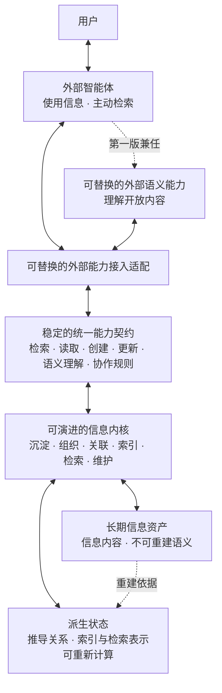

# 架构总纲

> 本文档是[《产品需求》](../product/requirements.md)的架构设计总纲。需求文档是产品意图的唯一依据；本文只回答系统采用什么总体结构、各部分承担什么职责、彼此如何依赖，以及哪些架构约束必须长期成立。
>
> 本文档不包含实施计划、版本排期、任务拆解、模块级设计、数据表结构、接口字段、技术栈选择或性能参数。后续设计不得以实现便利为由改变需求；如两份文档发生冲突，以需求文档为准。

## 一、架构使命

> Ownward 不是普通的“智能记忆工具”，而是在定义现在和未来所有智能个体共享的用户信息底座。这个产品本质足够大、足够清晰，也足够长久；只要 Ownward 始终掌握信息资产、信息组织和统一核心，而不退化成模型包装层，它就是能够经得起时间检验的顶级产品方向。

个人信息体系不是某个智能个体的记忆模块，也不是在既有笔记工具上增加智能检索。它需要同时成立三个事实：

1. 个人信息是用户长期持有、独立于任何智能个体和某一代体系内核的基础资产。
2. 内核是产品的核心能力，负责信息的沉淀、组织、关联、索引、检索与持续维护，并决定体系能够达到的质量上限。
3. 现在和未来任何形态的智能个体通过同一套核心能力使用和补充这些资产，用户通过外部智能个体使用体系。

因此，总体架构必须稳定地分离**长期信息资产、可演进内核、可替换的通用语义能力、统一能力契约和可替换接入形态**，同时保证它们能够组成一个完整产品，而不是彼此割裂的系统。

## 二、架构驱动因素

架构由需求文档中的以下目标共同驱动：

- **资产长期独立**：信息不因智能个体、设备、第三方服务或体系内核的变化而失去。
- **内核持续演进**：组织关系、索引方式和检索能力可以整体升级、替换或重建。
- **组织复杂度内化**：体系自主维护复杂关系，不向外部智能体转嫁目录、分类体系或关系结构的设计责任。
- **检索质量与时效并重**：任何一项都不能通过牺牲另一项取得表面优势，且两者都要持续处于同类系统前沿。
- **低成本沉淀**：信息进入体系后能够迅速成为可检索、可使用的资产，整理责任由体系承担。
- **统一核心**：不同形态的智能个体共享相同的信息语义和核心操作。
- **职责边界稳定**：体系只直接服务外部智能体；主动检索的方向选择、证据评估、结束判断和结果组织由外部智能体承担，体系不承担用户交互，也不内置替代它的智能体。
- **对外兼容、对内开放**：外部接入不制造迁移壁垒，内部结构不被现有协议和产品形态限制。
- **轻量高效**：架构不能以不必要的常驻组件、数据复制或处理链路换取功能完整性，资源占用与端到端效率都必须具备达到同类前沿的路径。
- **可验证恢复**：有效备份能够完整恢复为可用的信息资产。

任何架构决策都必须能够回到这些驱动因素；无法回溯到需求的能力，不进入总纲。

## 三、总体架构

个人信息体系采用以下总体结构：

这套结构的依赖方向是固定的：

- 用户通过外部智能体使用体系；面向用户的交互与主动检索决策不进入 Ownward。
- 接入适配只负责协议映射，不形成信息权威；所有外部智能体都通过统一能力契约使用同一内核。
- 能力契约稳定表达产品语义，不暴露或绑定内核的算法、模型、存储和外部协议。
- 通用语义能力是通过稳定契约接入的可替换外部能力，不绑定某个智能体、会话、模型、服务或协议；它只承担开放内容理解，不形成信息权威、组织权威或主动检索决策。第一版由已经接入 Ownward 的同一个外部智能体兼任该角色，不内置第二个智能体，也不要求额外模型服务或密钥。
- 内核依据信息资产工作并维护派生状态；派生状态可以随内核演进而重建，不得成为信息资产的唯一载体。

## 四、长期信息资产

### 4.1 权威性

长期信息资产是体系唯一不可被派生状态替代的权威基础，包括体系已经接受并需要长期保留的信息内容，以及不能从这些内容中安全重建、丢失后会改变信息含义或可用性的明确语义。内核推导出的分类、关系、摘要、索引或其他表示不能取代其所依据的信息本身。

外部智能体的临时工作状态不属于信息资产；其中属于用户且可长期复用的部分，只有进入统一核心后才成为资产。

判断一项状态是否属于长期信息资产，采用同一条规则：**如果删除当前内核后无法从其余资产中可靠重建，并且丢失它会改变用户信息的含义，它就必须作为资产独立保存。**

### 4.2 独立性

信息资产必须具备脱离当前内核仍可识别和理解的规范表达。这里不要求绑定某一种文件格式或存储介质，但要求：

- 信息身份不等同于存储位置、目录层级或外部智能个体内部标识，也不能随具体存储实现的替换而失效；
- 信息含义不只存在于模型参数、提示词、索引或未文档化的程序逻辑中；
- 任何设备、第三方服务或部署位置都不能成为资产存在的唯一前提；
- 信息资产能够形成用户持有的完整、可验证副本。

### 4.3 稳定身份与持续演进

每项可独立引用的信息都具有稳定身份，不因存储位置、组织关系或内核代际变化而失效。

“长期稳定”指资产的归属、身份和可理解性保持稳定，不代表内容永不更新。内容可以通过统一核心持续创建和更新，但不能因此转而依赖某一代内核。

## 五、信息内核

内核不是简单的使用方式或可有可无的中间层，而是个人信息体系形成差异化价值的核心。它对信息资产负责，但不拥有信息资产。

内核承担五类长期职责：

1. **沉淀与维护**：接收创建和更新，保持信息身份、内容及必要语义的一致性。
2. **语义组织**：通过[语义理解架构](../modules/semantics/README.md)使用可替换的外部语义能力理解开放内容，由内核将带来源、依据和不确定性的候选判断转化为可靠、可演进的组织状态，并持续维护多重归属、层级、交叉、组合及场景关系。确定性逻辑只负责资产、身份、版本、来源、证据、冲突、派生状态生命周期和结构不变量，不得假装独立判断开放内容真伪，也不得依靠枚举领域、词语、句式或验收样本维持通用语义组织能力。
3. **检索支持**：提供基于组织关系的可组合、可迭代检索能力，供外部智能体持续获取证据。
4. **协作规则**：统一提供智能个体使用、维护和主动补充体系所需的定义与规则。
5. **状态演进**：随信息增长和内核升级持续修正组织状态，并管理派生状态的失效与重建。

内核的复杂度只能来自履行上述职责的必要性；“可替换”只要求它不能绑架信息资产，不意味着降低其地位或质量上限。

## 六、逻辑信息模型

### 6.1 关系图是逻辑结构

信息不能以单一目录树作为权威组织结构。体系采用可表达多种关系的**语义关系图**作为逻辑模型：同一信息可以同时参与多个层级、归属、交叉和组合关系，而无需因归属不同复制多份内容。

逻辑模型不得以对话、文档、知识或任务等任何单一来源或信息类型为边界。

这里的“图”指信息节点及关系的数据结构，不是界面展示形式，也不要求物理存储采用图数据库。

### 6.2 语义边界

逻辑模型以具有稳定身份的信息及其语义关联为基础，能够表达关系类型、方向和必要的适用场景；只有信息含义或适用性依赖场景时才建立场景关联。层级、分类和目录只是针对特定目的形成的组织视图，不是信息唯一、永久的归属位置。

语义关系分为两类：

- **明确语义**：通过创建或更新直接提供，且无法仅凭原始内容安全重建；作为长期信息资产保存。
- **推导语义**：由内核根据资产推导出的关系、归并、层级或组合；属于可演进、可重新计算的组织状态。

这一区分保证内核可以大胆演进，同时不会在重建时丢失用户已经赋予信息的真实含义。

语义模型可以随内核演进，但不得改变既有信息身份或使已有语义失去原意；当前内核无法理解的既有语义也必须被完整保留。

## 七、核心运行机制

本节只规定跨越具体实现仍必须成立的运行关系，不规定算法和执行步骤。

### 7.1 信息沉淀

被体系接受的信息必须先可靠地成为长期信息资产；派生关系、索引或检索表示的生成失败，不得造成信息丢失。

资产持久化与派生状态生成相互解耦：新信息不必等待所有组织工作完成才进入体系，但必须尽快达到基础可检索状态，随后由内核持续完善其组织与检索状态。

### 7.2 信息检索

主动检索由外部智能体推进。内核通过统一能力契约提供可组合、可迭代的检索操作，并返回具有稳定信息身份和关联语义的结果；智能个体依据累计证据选择后续操作、调整方向、判断结束并组织结果。

统一能力契约必须允许简单检索一次完成，也允许复杂检索依据中间证据持续推进，不能强迫不同任务经过同一条固定流程。

内核内部的检索能力可以组合、比较和替换，但必须共同遵守相同的信息身份、场景语义和质量约束，并由长期信息资产、组织状态和相关场景共同支撑。

向量模型作为可替换的语义检索能力，提供语义表示、候选召回和相似度排序；内核统一组合向量、词法、关系、场景及累计证据，形成完整检索能力，并对端到端检索质量与时效负责。

### 7.3 持续维护

内核根据进入体系的新信息和修正增量维护关系与检索状态，不要求使用方手工同步多个目录、分类或副本。

内核可以持续修正推导关系，但不得因此改变作为权威基础的长期信息资产。

### 7.4 使用与成长闭环

个人信息体系必须形成“使用信息—产生经验与反馈—沉淀新信息—更新组织与检索状态—再次使用”的完整闭环。智能个体在真实场景中积累的错误教训、解决经验和可复用路径，由同一核心回到个人信息体系，使后续使用获得更高的质量与效率。

## 八、统一能力契约与接入

软件智能体、具身智能体及未来其他形态的智能个体，都通过统一能力契约使用体系。契约稳定表达检索、读取、创建、更新、语义理解及获取协作规则等产品能力，不等同于某一种接口协议。

外部语义能力通过同一契约取得有边界的语义工作并返回候选判断。它不能直接写入关系图或派生状态；内核验证身份、版本、来源、证据和结构不变量，管理冲突与不确定性并保持组织权威，但不假装独立判断开放语义真伪。第一版可以由同一个接入智能体兼任语义能力；语义理解暂不可用时，资产写入与不依赖该判断的核心能力继续成立，未完成状态必须明确可见。

不同智能体的接入适配只负责将各自协议映射到统一能力契约，不形成独立的信息权威，也不取代内核的信息组织与检索能力。

内核及信息资产均不依赖某个外部智能个体的私有记忆、提示格式或工具协议。新的智能个体形态通过增加适配进入体系，而不是要求体系迁移到它的内部模型中。

## 九、内核演进与恢复

### 9.1 内核演进

内核的算法、组织方式、关系模型实现和检索实现可以持续升级或整体替换。

新内核必须能够依据长期信息资产重建所需的派生状态。内核切换以资产完整、语义连续和核心能力可用为前提；内核升级不能要求用户重建个人信息体系。

内核的组织与检索能力必须具有一致的端到端评价边界，使不同内核代际能够在等价信息、任务和约束下比较质量与时效；能力替换不得改变长期信息资产。

### 9.2 故障隔离

长期信息资产与派生状态属于不同故障边界：

- 派生状态损坏时，优先从长期信息资产重建；
- 内核无法运行时，信息资产本身仍保持完整、可识别和可恢复；
- 接入形态或外部智能个体失效时，不影响信息资产和内核状态；
- 任何派生状态都不得成为恢复长期信息资产的必要前提。

### 9.3 备份与恢复边界

备份必须覆盖长期信息资产及所有无法安全重建的持久语义。可完全重建的组织投影、检索表示和缓存可以不作为资产级备份的必要部分。

备份是否有效以能否完整恢复为可用的信息资产为准，而不是以是否成功复制文件或存储记录为准。

## 十、质量属性与架构响应

质量目标不在总纲中固化实现，但会约束后续所有设计：新增的组件、状态、数据副本或处理链路必须对明确需求或可验证的质量收益不可缺少。

| 质量属性或核心要求 | 架构响应 |
|---|---|
| 检索时效 | 派生检索表示与长期资产分离，允许针对不同任务建立可替换、可重建的高性能表示，并使简单检索不必经过复杂链路。 |
| 检索质量 | 内核通过统一契约提供基于稳定身份、语义关系、场景和长期信息资产的可组合检索能力，并在固定智能体与检索预算下比较不同内核代际。 |
| 信息组织质量 | 采用语义关系图，由可替换的外部语义能力提出带依据和不确定性的候选判断，内核依据来源、冲突与结构约束维护可追溯、可修正的组织状态。 |
| 信息沉淀效率 | 资产持久化与派生状态生成解耦，新信息先安全进入体系并获得基础可检索性，再持续完善组织状态。 |
| 轻量运行 | 在不牺牲功能完整性、信息质量和资产耐久性的前提下，只保留产品不可缺少的边界；派生状态和处理链路必须具有可验证的质量或时效收益。 |
| 使用中持续成长 | 使用产生的新信息、经验和反馈通过统一核心回流，持续更新组织与检索状态。 |
| 信息资产稳定性与内核可演进性 | 长期信息资产是权威源，派生状态可由新内核重建。 |
| 信息持久性与可恢复性 | 资产级备份只依赖长期信息资产与不可重建语义，并以完整恢复验证其有效性。 |
| 各类智能体共享核心 | 所有智能体使用同一能力契约、信息身份和内核，不形成平行体系。 |
| 对外兼容、对内开放 | 外部协议由适配层消化；资产模型与内核不绑定现有智能体协议和技术形式。 |

## 十一、长期架构不变量

无论未来采用何种技术，以下约束不得改变：

1. 长期信息资产始终属于用户，并且是不可由派生状态替代的权威基础。
2. 内核负责组织、关联与索引，并提供检索能力，但信息资产不依赖某一代内核才能存在。
3. 任何无法安全重建且会影响信息含义的状态，都不能只保存在内核派生状态中。
4. 信息身份独立于存储位置、分类层级、接入协议和外部智能个体。
5. 语义关系图是逻辑组织模型，物理存储和界面形式均可独立演进。
6. 所有智能个体共享同一套核心信息能力，不允许接入层形成旁路写入或私有真相。
7. 主动检索的方向选择、证据评估、结束判断和结果组织由外部智能体承担，体系不内置替代外部智能体的检索智能。
8. 通用语义能力、检索技术、模型、索引和组织算法均可替换，任何一种都不能成为信息资产的唯一解释者；确定性逻辑不得依靠枚举特定领域、词语、句式或验收样本实现通用语义组织。
9. 内核演进不得以损害既有信息、明确语义和可恢复性为代价。
10. 通用语义理解通过稳定契约由可替换的外部能力提供，不绑定某个智能体、模型、服务或协议；第一版由接入的外部智能体兼任该角色。Ownward 不内置第二个智能体，内核始终掌握资产、组织状态和核心规则。

## 十二、总纲暂不决定的事项

以下内容必须在总纲约束下继续设计，但不应在当前阶段提前固化：

- 信息资产的具体文件格式、数据库或存储介质；
- 语义关系图的物理存储方式；
- 检索算法、索引类型、模型及其组合方式；
- 内核内部的模块划分、进程结构和部署拓扑；
- 备份与恢复的具体实现；
- 对外协议和智能体工具形式；
- 性能基线、评测集与具体质量目标值。

这些选择可以随技术前沿变化，但不得改变本总纲规定的资产权威性、依赖方向、逻辑信息模型和统一核心。
