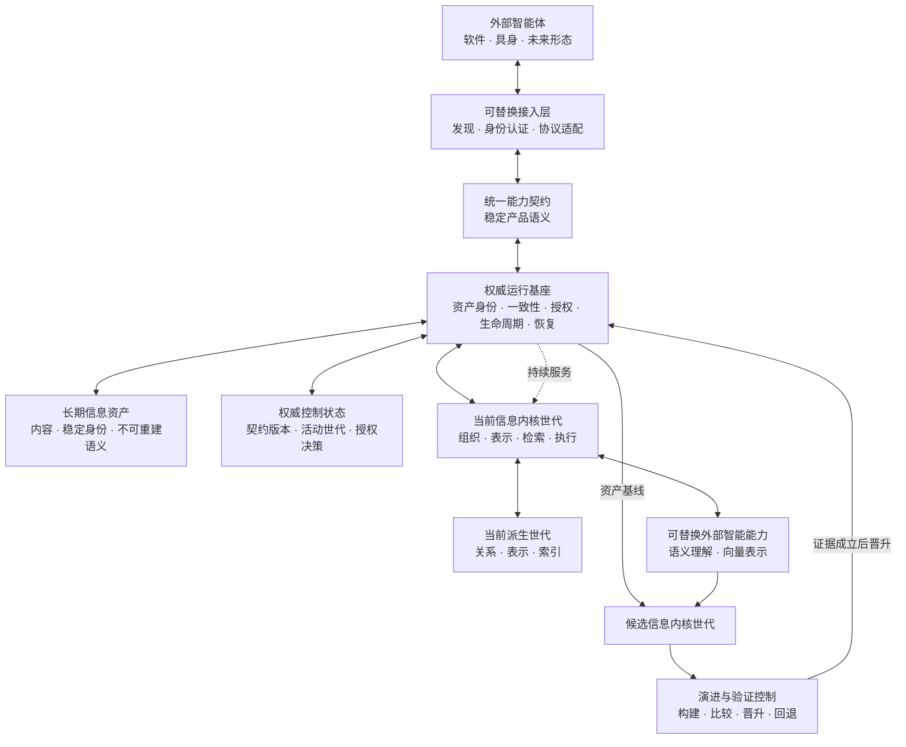

# 架构总纲

> 本文档是[《产品需求》](../product/requirements.md)的架构设计总纲。需求文档是产品意图的唯一依据；本文只说明 Ownward 采用什么总体结构、各部分承担什么职责、彼此如何依赖，以及哪些架构约束必须长期成立。
>
> 本文不包含实施计划、迁移步骤、版本排期、任务拆解、接口字段、技术选型或性能参数。实现不得以便利为由改变需求；发生冲突时，以产品需求为准。

## 一、核心架构

Ownward 采用**权威基座—能力世代架构**：

> **资产永久、契约稳定、实现可替换、候选按世代演进、所有接入共享同一权威。**

个人信息比智能体、设备、模型、协议、算法和代码活得更久。架构稳定的不是某个实现，而是用户对信息的所有权、信息身份与含义、产品能力语义，以及能力安全替换的规则。

Ownward 是与通用智能体平级的个人信息基础设施，不是某个智能体的记忆组件、模型包装层或“笔记加检索”。它由用户长期持有，供现在和未来任何形态的智能体通过同一核心共同使用和补充；用户通过外部智能体使用体系，Ownward 不直接承担用户交互。

Ownward 不追求“一切皆插件”或任意代码热插拔。真正需要的是：当前有效能力持续可用，候选实现能够独立建立、验证、晋升和回退；替换不能改变用户信息、制造平行真相或迫使无关能力重新验证。

## 二、长期原则

1. **一个信息权威**：一个用户只有一份活动信息体系；多个智能体、接入方式和能力实现不得形成平行真相。
2. **资产独立于实现**：用户信息不依赖某个智能体、模型、内核、存储、协议或设备才能存在、理解和恢复。
3. **内核持续演进**：组织与检索是产品价值核心；当前内核持续服务，候选内核独立竞争，只凭更优证据晋升。
4. **复杂度由状态决定**：替换边界来自职责、状态和生命周期，不来自通用插件框架或抽象数量。
5. **接入不是产品核心**：任意智能体通过同一产品能力使用同一信息权威；协议和设备差异止于接入层。
6. **边界不牺牲效率**：默认在同一进程内直接调用；只有资源、故障或部署事实要求时才跨进程。

## 三、总体结构

这是一个窄腰结构：上方可以出现任意智能体和接入形式，下方可以出现任意内核、模型和存储实现；中间始终只有一套稳定的产品能力语义和一份权威信息资产。

## 四、职责与权力边界

| 部分 | 唯一职责 | 明确不得承担 |
|---|---|---|
| 长期信息资产 | 保存用户接受的信息、稳定身份、明确语义和必要来源 | 保存模型、索引、算法私有状态或接入方临时状态 |
| 权威控制状态 | 保存契约版本、当前能力选择和已经成立的产品授权决策 | 保存个人信息内容、可重建派生状态或算法私有配置 |
| 权威运行基座 | 维护资产身份、版本、一致性、授权、备份恢复和能力世代生命周期 | 实现具体组织、检索、模型推理或外部协议 |
| 信息内核世代 | 把资产转化为高质量组织与检索能力，对质量、时效和资源负责 | 改变资产原意、拥有接入身份或成为资产唯一解释者 |
| 派生世代 | 保存特定内核可重建的关系、表示和索引 | 成为信息权威或承载不可重建语义 |
| 外部智能能力 | 提供开放内容理解和语义表示 | 直接写资产、决定组织权威或拥有用户信息体系 |
| 统一能力契约 | 稳定表达检索、读取、创建、更新、语义协作和规则获取 | 暴露内部存储、算法、模型或部署方式 |
| 接入层 | 建立连接、认证智能体、映射协议并传递已认证主体 | 决定产品授权、保存私有真相、绕过能力契约或复制核心逻辑 |
| 演进与验证控制 | 识别候选直接依赖、生成证据、管理晋升和回退 | 进入正常请求主链路或用仓库状态代替制品身份 |

权威运行基座不是永远不变的二进制；它可以升级，但不能作为任意插件装卸。任何实现都必须继续理解既有资产并保持上述权力边界。

## 五、信息与状态模型

### 5.1 长期信息资产

长期信息资产是用户唯一不可由派生状态替代的权威基础，包括体系已经接受且需要长期保留的内容，以及无法从内容安全重建、丢失后会改变含义或可用性的明确语义。

外部智能体的临时工作状态不属于资产；其中属于用户且可长期复用的部分，只有被统一核心接受后才成为资产。“长期稳定”指归属、身份与可理解性稳定，不代表内容不可更新。

一项状态属于长期资产，当且仅当：**删除当前内核后无法从其余资产可靠重建，并且丢失它会改变用户信息的含义。**

资产身份独立于存储位置、目录层级、接入协议和外部智能体标识；资产含义不得只存在于模型参数、提示词、索引或未声明的程序逻辑中。用户能够持有完整、可验证、可恢复的资产副本。

### 5.2 逻辑信息模型

信息以具有稳定身份的节点及其语义关联形成**语义关系图**。同一信息可以同时参与层级、归属、交叉、组合和场景关系，无需因归属不同复制内容。目录、分类和层级只是面向特定目的的视图，不是永久权威结构；逻辑图也不要求物理存储采用图数据库。

逻辑模型不以对话、文档、知识、任务等任何单一来源或信息类型为边界；只有信息含义或适用性依赖场景时才建立场景关联。

明确提供且无法安全重建的语义属于长期资产；内核推导出的关系、归并、层级、表示和索引属于可重建的派生世代。内核可以修正推导语义，但不能改变资产原意或既有信息身份。

### 5.3 四类状态

| 状态 | 归属 | 生命周期 |
|---|---|---|
| 长期信息资产 | 用户 | 跨越所有内核、模型、接入和设备长期存在 |
| 权威控制状态 | 权威运行基座 | 随契约和能力世代显式迁移，不随进程丢失 |
| 能力派生世代 | 确定的内核或模型世代 | 可并存、验证、晋升、回退和回收 |
| 运行状态 | 当前进程与请求 | 可丢弃，不承载唯一事实 |

权威控制状态保持最小，只保存无法从资产和装配清单安全推导的产品决定。任何新状态必须明确归入一类；无法归类意味着职责边界尚未成立。

## 六、信息内核与产品运行

信息内核是组织与检索能力的完整世代，由经过共同验证的组织、表示、检索、派生存储和执行能力组成。内部能力可以独立演进，但线上只使用一致、可复现的组合，不临时拼接未经共同验证的新旧部件。

内核长期承担五项职责：

1. **沉淀与维护**：接收创建和更新，保持资产身份、内容及必要语义一致。
2. **语义组织**：通过[语义理解架构](../modules/semantics/README.md)使用可替换外部能力理解开放内容，由内核依据来源、证据、不确定性和结构不变量形成可修正的组织状态。
3. **检索支持**：提供基于资产、关系、场景与累计证据的可组合、可迭代检索能力。
4. **协作规则**：统一提供智能体使用、维护和补充体系所需的定义与规则。
5. **状态演进**：随信息增长持续修正组织状态，并管理派生状态的失效与重建。

外部语义能力只提出带能力身份、输入身份、来源、证据和不确定性的候选判断；内核负责身份、版本、冲突、派生生命周期和结构不变量。确定性逻辑不得假装独立判断开放语义真伪，也不得依靠枚举领域、词语、句式或验收样本维持通用语义能力。外部智能体与外部语义能力是逻辑角色，第一版可以由同一智能体兼任，不因此内置第二个智能体或额外模型服务。

资产先可靠成立；派生关系、索引或语义处理失败只能形成明确、可恢复的待处理状态，不能造成资产丢失。外部智能体负责主动检索的方向选择、证据评估、结束判断和结果组织；Ownward 不内置替代它的检索智能体。

统一能力契约允许简单检索一次完成，也允许复杂检索依据累计证据持续调整方向；不能强迫不同任务经过同一固定流程。

体系通过“使用信息—产生经验与反馈—沉淀新信息—更新组织与检索状态—再次使用”持续成长。外部语义能力暂不可用时，资产沉淀、稳定身份读取及不依赖该判断的能力仍然成立；未完成状态必须明确可见。

所有读取和变更都经过权威运行基座。基座依据已认证主体执行授权并维护版本一致性；并发变更发生冲突时必须显式返回，不允许静默覆盖。接入层、模型和内核均不能绕过资产权威。

派生状态损坏时从长期资产重建；内核、接入或外部智能体失效时，资产仍完整、可识别、可恢复，且任何派生状态都不是恢复资产的前提。备份覆盖长期资产及全部不可安全重建的持久语义，并以能够完整恢复成可用资产为有效标准。

## 七、契约、组合与依赖

1. 统一能力契约表达产品语义，不等同于 MCP、SDK、网络协议或进程接口。
2. 可变实现只依赖稳定能力端口，不导入其他可变实现的具体类型。
3. 系统只有一个显式装配入口；经过校验的组合清单决定当前产品，构造默认值不得暗中改变产品语义。
4. 权威持久化端口只提供资产耐久提交、版本化读取、变化范围、备份和恢复；具体存储不得解释产品语义。
5. 接入层只能调用统一能力契约；内核只能通过资产、派生和智能能力端口工作。
6. 外部智能能力的输出必须携带能力身份、输入身份和来源，不能作为无来源事实进入派生状态。
7. 稳定契约显式版本化；兼容变化保持既有调用方可用，破坏性变化使用新版本并经过迁移。
8. 每个内核世代声明其资产契约、能力契约、智能能力和派生格式；不兼容组合在装配前被机械拒绝。
9. 组件边界优先采用同一进程内直接调用，不用网络、序列化或微服务证明模块化。

## 八、可替换能力与生命周期

| 能力 | 替换后的状态影响 | 必要证明 |
|---|---|---|
| 接入形态 | 不改变资产、内核和派生世代 | 契约、身份权限和端到端接入成立 |
| 外部语义能力 | 资产不变；受其影响的派生理解可以重算 | 输入输出契约、来源、不确定性和组织质量成立 |
| 向量模型与空间 | 资产不变；建立新向量派生世代 | 空间一致性、检索质量、时效和资源成立 |
| 组织能力 | 资产不变；建立新组织派生世代 | 语义保持、关系质量、增量一致性和检索增益成立 |
| 检索能力 | 资产不变；索引和编排可以整体替换 | 质量、时效、资源及各任务类型成立 |
| 派生存储实现 | 只迁移或重建可派生状态 | 完整性、恢复、切换和资源成立 |
| 长期资产存储实现 | 迁移权威资产，风险最高 | 身份、内容、不可重建语义和恢复完全一致 |
| 完整信息内核 | 当前世代继续有效，候选旁路建立 | 全部内核能力、目标提升和无实质退化成立 |

替换方式由状态决定：

- **无状态能力**在契约与集成验证后于安全边界切换，观察成立前保留旧实现。
- **派生状态能力**拥有独立世代，按资产基线构建、追平、验证、晋升和回退，不能修改当前世代。
- **权威持久化实现**复制并验证全部资产与控制状态，追平变化后原子转移唯一写入权；旧实现只能保留为只读回退源，不得用长期双写制造双权威。

派生候选必须记录资产基线，独立构建并验证，再追平基线后的全部变化；权威基座以短暂写入屏障或等价机制关闭最后版本间隙，只有候选与当前资产版本一致时才能原子晋升。回退目标同样必须先追平当前资产并通过健康检查。

可替换性必须通过“当前能力持续有效—候选独立准备—证据成立—受控切换—观察—可回退”的完整生命周期证明，不能仅凭接口存在或依赖可注入宣称成立。晋升和回退都不得丢失权威基座已经接受的更新。

## 九、制品身份与验证边界

Git 提交不是产品能力身份，只记录开发来源。候选身份由自身内容及其真实直接依赖构成，包括契约、基座、内核能力、模型与空间、数据格式、运行配置和实际装配清单。

独立身份是构建与验证边界，不要求组件成为独立文件或进程。同一发布制品可以携带各组件的内容身份；组件自身及直接依赖未变时，外层打包或无关组件变化不得改变其身份。

验收证据分别绑定被测候选、输入、执行环境和观察者，只因真正影响结论的节点变化而失效：

- 接入变化只失效相关接入、安全和集成证据；
- 内核能力变化只失效该能力及依赖它的内核证据；
- 模型或空间变化失效对应派生世代和检索证据；
- 资产契约或权威基座变化才触发资产、迁移和完整产品不变量复核；
- 文档、工作台、评测工具或无关功能变化不得使产品或内核证据失效。

评测工具也是独立制品；环境或观察者变化不改变候选身份，只使依赖它们的相应证据需要重新判断，不能被伪装成被测内核变化。

## 十、未来接入边界

Ownward 的长期产品形态是一处由用户选择部署的权威信息体系，供多个智能体共同访问；它不是多端同步，也不产生多个内核或多份活动资产。

接入层统一承担连接建立、智能体身份认证和协议差异，向内只呈现同一能力契约；权威运行基座依据认证身份执行产品授权。未来增加机器人、移动设备或新协议时，只增加或替换接入实现，不改变资产、内核和产品能力语义。

具体协议、认证体验和网络方案属于独立产品设计，不由本总纲提前决定。

## 十一、质量属性与架构响应

| 质量要求 | 架构响应 |
|---|---|
| 检索质量与时效 | 内核世代在固定资产、任务和资源约束下比较；候选独立验证，只有整体更优且无实质退化才晋升。 |
| 信息组织质量 | 语义关系图由可替换智能能力提供候选判断，内核依据来源、冲突和结构不变量维护可追溯组织状态。 |
| 信息沉淀效率 | 资产提交与派生处理解耦，信息先安全进入体系并获得基础可检索性，再持续完善组织状态。 |
| 轻量运行 | 稳定边界默认进程内直接调用；每个常驻组件、状态副本和处理链路都必须有不可替代的价值。 |
| 资产耐久与恢复 | 备份覆盖长期资产及不可重建语义，并以完整恢复为有效标准；派生状态可由资产重建。 |
| 多智能体共享 | 所有智能体使用同一能力契约、信息身份、授权基座和当前内核，不形成旁路写入。 |
| 持续演进 | 能力按世代独立建立和竞争，证据按直接依赖精确失效，失败候选不污染当前能力。 |

## 十二、长期架构不变量

1. 长期信息资产始终属于用户，是不可由派生状态替代的唯一权威基础。
2. 所有智能体共享同一套产品能力和信息权威；接入层不得形成旁路写入或私有真相。
3. 内核负责组织与检索，但资产不依赖某一代内核才能存在、理解和恢复。
4. 模型、组织、检索、存储、内核和接入实现都能按各自状态边界无损替换。
5. 候选能力不能污染当前能力；晋升和回退不能丢失任何已接受更新。
6. 正式证据只因真实直接依赖变化而失效，无关项目变更不能迫使稳定内核重测。
7. 架构边界不得给正常请求增加无必要的网络、序列化、复制或等待成本。
8. 不建设通用插件框架、插件市场、任意第三方代码热加载、无必要微服务或多份活动信息资产。
9. 未来能力只能使用本架构预留的稳定边界，不得反向改变当前产品范围和核心语义。

## 十三、总纲暂不决定的事项

- 信息资产、控制状态和派生世代的具体存储技术；
- 语义关系图的物理表示；
- 内核算法、索引、模型及其内部组合；
- 组件的目录、进程和部署拓扑；
- 备份恢复、外部协议和认证体验的具体实现；
- 评测集、性能基线和具体质量目标值。

这些选择可以随技术前沿变化，但不得改变本总纲规定的唯一权威、状态归属、依赖方向、替换生命周期和证据边界。
