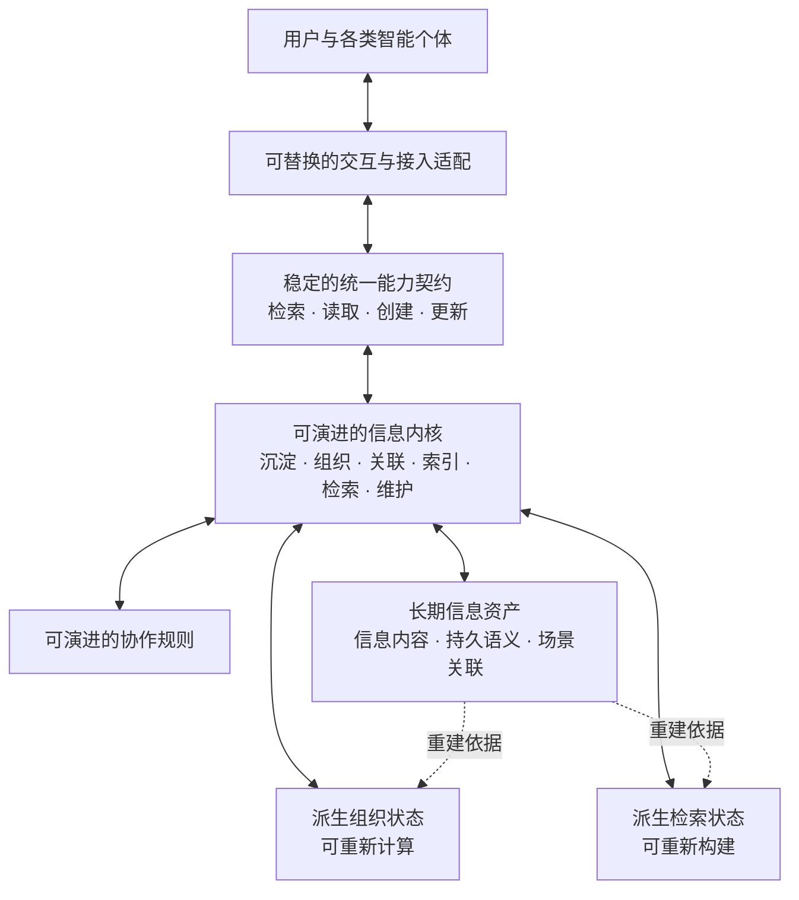

# 架构总纲

> 本文档是[《产品需求》](../product/requirements.md)的架构设计总纲。需求文档是产品意图的唯一依据；本文只回答系统采用什么总体结构、各部分承担什么职责、彼此如何依赖，以及哪些架构约束必须长期成立。
>
> 本文档不包含实施计划、版本排期、任务拆解、模块级设计、数据表结构、接口字段、技术栈选择或性能参数。后续设计不得以实现便利为由改变需求；如两份文档发生冲突，以需求文档为准。

## 一、架构使命

个人信息体系不是某个智能个体的记忆模块，也不是在既有笔记工具上增加智能检索。它需要同时成立三个事实：

1. 个人信息是用户长期持有、独立于任何智能个体和某一代体系内核的基础资产。
2. 内核是产品的核心能力，负责信息的沉淀、组织、关联、索引、检索与持续维护，并决定体系能够达到的质量上限。
3. 用户以及现在和未来任何形态的智能个体，通过同一套核心能力使用和补充这些资产。

因此，总体架构必须稳定地分离**长期信息资产、可演进内核、统一能力契约和可替换接入形态**，同时保证它们能够组成一个完整产品，而不是四套彼此割裂的系统。

## 二、架构驱动因素

架构由需求文档中的以下目标共同驱动：

- **资产长期独立**：信息不因智能个体、设备、第三方服务或体系内核的变化而失去。
- **内核持续演进**：组织关系、索引方式和检索能力可以整体升级、替换或重建。
- **组织复杂度内化**：体系自主维护复杂关系，不要求用户设计目录、分类体系或关系结构。
- **检索质量与时效并重**：任何一项都不能通过牺牲另一项取得表面优势，且两者都要持续处于同类系统前沿。
- **低成本沉淀**：信息进入体系后能够迅速成为可检索、可使用的资产，整理责任由体系承担。
- **统一核心**：用户与不同形态的智能个体共享相同的信息语义和核心操作。
- **对外兼容、对内开放**：外部接入不制造迁移壁垒，内部结构不被现有协议和产品形态限制。
- **可验证恢复**：有效备份能够完整恢复为可用的信息资产。

任何架构决策都必须能够回到这些驱动因素；无法回溯到需求的能力，不进入总纲。

## 三、总体架构

个人信息体系采用以下总体结构：

这套结构的依赖方向是固定的：

- 接入形态依赖统一能力契约，不能绕过契约形成自己的信息体系。
- 能力契约由内核实现，但不暴露内核的具体算法、模型和存储形式。
- 内核依据信息资产工作并维护派生状态，信息资产不依赖某一代内核才能存在。
- 派生组织状态和检索状态服务于内核，可以随内核演进而重建，不得成为信息资产的唯一载体。

## 四、长期信息资产

### 4.1 权威性

长期信息资产是体系唯一不可被派生状态替代的权威基础。内核生成的分类、关系、摘要、索引或其他表示，不能取代其所依据的信息本身。

信息资产至少包含：

- 用户或智能个体明确提交并要求保留的信息内容；
- 不能从内容中安全重建的明确语义，例如必要的场景关联和直接提供的关系；
- 保持信息可理解和可继续使用所必需的身份与语义描述。

判断一项状态是否属于长期信息资产，采用同一条规则：**如果删除当前内核后无法从其余资产中可靠重建，并且丢失它会改变用户信息的含义，它就必须作为资产独立保存。**

### 4.2 独立性

信息资产必须具备脱离当前内核仍可识别和理解的规范表达。这里不要求绑定某一种文件格式或存储介质，但要求：

- 信息身份不等同于存储位置、目录层级或外部智能个体内部标识，也不能随具体存储实现的替换而失效；
- 信息含义不只存在于模型参数、提示词、索引或未文档化的程序逻辑中；
- 任何设备、第三方服务或部署位置都不能成为资产存在的唯一前提；
- 信息资产能够形成用户持有的完整、可验证副本。

### 4.3 稳定身份与持续演进

每项可独立引用的信息都具有稳定身份，不因存储位置、组织关系或内核代际变化而失效。

“长期稳定”指资产的归属、身份和可理解性保持稳定，不代表内容永不更新。内容可以通过统一核心持续创建和更新，但不能因此转而依赖某一代内核。

## 五、信息内核

内核不是简单的使用方式或可有可无的中间层，而是个人信息体系形成差异化价值的核心。它对信息资产负责，但不拥有信息资产。

内核承担五类长期职责：

1. **沉淀与维护**：接收创建和更新，保持信息身份、内容及必要语义的一致性。
2. **语义组织**：识别信息含义，维护多重归属、层级、交叉、组合及场景关系。
3. **检索编排**：理解检索意图，综合可用的组织关系与检索能力，返回适合当前场景的信息。
4. **协作规则**：统一提供智能个体使用、维护和主动补充体系所需的定义与规则。
5. **状态演进**：随信息增长和内核升级持续修正组织状态，并管理派生状态的失效与重建。

内核可以高度复杂，也应持续追求最优；“可替换”只是要求它不能绑架信息资产，不意味着降低其地位或能力上限。

## 六、逻辑信息模型

### 6.1 关系图是逻辑结构

信息不能以单一目录树作为权威组织结构。体系采用可表达多种关系的**语义关系图**作为逻辑模型：同一信息可以同时参与多个层级、归属、交叉和组合关系，而无需因归属不同复制多份内容。

这里的“图”指信息节点及关系的数据结构，不是界面展示形式，也不要求物理存储采用图数据库。

### 6.2 核心语义对象

逻辑模型由三类核心语义对象构成：

- **信息单元**：具有稳定身份、可独立引用的信息内容；其粒度不由存储结构强制限定。
- **关系陈述**：表达两个或多个信息单元之间的有类型关系，支持表达方向和适用场景；关系本身可以被独立识别和维护。
- **场景**：仅在信息含义或适用性依赖场景时建立关联，不将所有信息强制场景化。

层级、分类和目录都是语义关系图在特定目的下形成的组织视图，不是信息唯一、永久的归属位置。

### 6.3 明确语义与推导语义

语义关系分为两类：

- **明确语义**：由用户或智能个体通过创建或更新直接提供，且无法仅凭原始内容安全重建；作为长期信息资产保存。
- **推导语义**：由内核根据资产推导出的关系、归并、层级或组合；属于可演进、可重新计算的组织状态。

这一区分保证内核可以大胆演进，同时不会在重建时丢失用户已经赋予信息的真实含义。

### 6.4 语义模型演进

信息类型、关系类型和场景类型不采用封闭枚举。内核可以随信息范围与组织能力的发展扩展语义模型，但不得改变既有信息身份或使已有语义失去原意；新内核无法识别的既有语义也必须被完整保留。

## 七、核心运行机制

本节只规定跨越具体实现仍必须成立的运行关系，不规定算法和执行步骤。

### 7.1 信息沉淀

被体系接受的信息先形成长期信息资产，再由内核进行深度组织和检索状态更新。组织或索引过程失败，不得造成已经接受的信息丢失。

信息的持久写入与深度组织相互解耦：新信息不必等待所有组织工作完成才进入体系，但必须尽快达到基础可检索状态；内核随后持续完善其关系与检索表示。

### 7.2 信息检索

检索由内核统一编排，不将某一种检索范式固化为体系本身。不同检索能力可以组合、比较和替换，但必须共同遵守相同的信息身份、场景语义和质量约束。

检索由长期信息资产、组织状态和相关场景共同支撑。

### 7.3 持续维护

内核根据进入体系的新信息和修正增量维护关系与检索状态，不要求用户手工同步多个目录、分类或副本。

内核可以持续修正推导关系，但不得因此改变作为权威基础的长期信息资产。

### 7.4 使用与成长闭环

个人信息体系必须形成“使用信息—产生经验与反馈—沉淀新信息—更新组织与检索状态—再次使用”的完整闭环。智能个体在真实场景中积累的错误教训、解决经验和可复用路径，由同一核心回到个人信息体系，使后续使用获得更高的质量与效率。

## 八、统一能力契约与接入

用户界面、软件智能体、具身智能体及未来其他形态的智能个体，都通过统一能力契约使用体系。契约定义稳定的产品语义，不等同于某一种接口协议。

协作规则与能力契约相互分离：能力契约稳定定义如何使用核心能力，协作规则由体系统一管理并通过能力契约提供，不由各接入形态分别定义。

统一能力契约至少覆盖需求已经确定的能力：

- 检索与读取信息；
- 创建与更新信息；
- 获取使用、维护与主动补充体系所需的协作规则。

不同接入形态负责将各自的交互与协议映射到统一能力契约，不形成独立的信息权威，也不取代内核的组织与检索能力。用户交互可以面向人的理解方式设计，智能个体接入可以面向机器协作设计，但二者必须落到相同的信息身份和核心操作上。

内核及信息资产均不依赖某个外部智能个体的私有记忆、提示格式或工具协议。新的智能个体形态通过增加适配进入体系，而不是要求体系迁移到它的内部模型中。

## 九、内核演进与恢复

### 9.1 内核演进

内核的算法、组织方式、关系模型实现和检索实现可以持续升级或整体替换。

新内核必须能够依据长期信息资产重建所需的组织状态和检索状态。内核切换以资产完整、语义连续和核心能力可用为前提；内核升级不能要求用户重建个人信息体系。

内核的组织与检索能力必须具有一致的端到端评价边界，使不同内核代际能够在等价信息、任务和约束下比较质量与时效；能力替换不得改变长期信息资产。

### 9.2 故障隔离

信息资产、组织状态和检索状态属于不同故障边界：

- 组织状态或检索状态损坏时，优先从长期信息资产重建；
- 内核无法运行时，信息资产本身仍保持完整、可识别和可恢复；
- 接入形态或外部智能个体失效时，不影响信息资产和内核状态；
- 任何派生状态都不得成为恢复长期信息资产的必要前提。

### 9.3 备份与恢复边界

备份必须覆盖长期信息资产及所有无法安全重建的持久语义。可完全重建的组织投影、检索表示和缓存可以不作为资产级备份的必要部分。

备份是否有效以能否完整恢复为可用的信息资产为准，而不是以是否成功复制文件或存储记录为准。

## 十、质量属性与架构响应

| 质量属性或核心要求 | 架构响应 |
|---|---|
| 检索时效 | 检索状态与长期资产分离，允许针对不同任务建立可替换、可重建的高性能检索表示，并在等价约束下评价。 |
| 检索质量 | 内核统一编排检索能力，并以稳定身份、语义关系、场景和长期信息资产共同约束结果；不同内核代际可以在等价任务下比较。 |
| 信息组织质量 | 采用语义关系图，区分长期保存的明确语义与可重新计算的推导语义，由内核持续维护。 |
| 信息沉淀效率 | 持久写入与深度组织解耦，新信息先安全进入体系并获得基础可检索性，再持续完善组织状态。 |
| 使用中持续成长 | 使用产生的新信息、经验和反馈通过统一核心回流，持续更新组织与检索状态。 |
| 信息资产稳定性与内核可演进性 | 长期信息资产是权威源，组织状态和检索状态均可由新内核重建。 |
| 信息持久性与可恢复性 | 资产级备份只依赖长期信息资产与不可重建语义，并以完整恢复验证其有效性。 |
| 用户与智能个体共享核心 | 所有交互形态使用同一能力契约、信息身份和内核，不形成平行体系。 |
| 对外兼容、对内开放 | 外部协议由适配层消化；资产模型与内核不绑定现有智能体协议和技术形式。 |

## 十一、长期架构不变量

无论未来采用何种技术，以下约束不得改变：

1. 长期信息资产始终属于用户，并且是不可由派生状态替代的权威基础。
2. 内核负责组织、关联、索引和检索，但信息资产不依赖某一代内核才能存在。
3. 任何无法安全重建且会影响信息含义的状态，都不能只保存在内核派生状态中。
4. 信息身份独立于存储位置、分类层级、接入协议和外部智能个体。
5. 语义关系图是逻辑组织模型，物理存储和界面形式均可独立演进。
6. 用户和所有智能个体共享同一套核心信息能力，不允许接入层形成旁路写入或私有真相。
7. 检索技术、模型、索引和组织算法均可替换，任何一种都不能成为信息资产的唯一解释者。
8. 内核演进不得以损害既有信息、明确语义和可恢复性为代价。

## 十二、总纲暂不决定的事项

以下内容必须在总纲约束下继续设计，但不应在当前阶段提前固化：

- 信息资产的具体文件格式、数据库或存储介质；
- 语义关系图的物理存储方式；
- 检索算法、索引类型、模型及其组合方式；
- 内核内部的模块划分、进程结构和部署拓扑；
- 备份与恢复的具体实现；
- 对外协议、智能体工具形式和用户界面；
- 性能基线、评测集与具体质量目标值。

这些选择可以随技术前沿变化，但不得改变本总纲规定的资产权威性、依赖方向、逻辑信息模型和统一核心。
