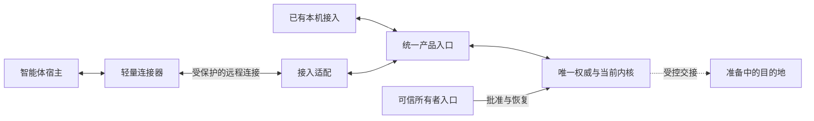

# 接入与部署迁移架构

实现[跨地点访问与便捷迁移](../../product/cross-location-access.md)；产品授权复用[用户控制架构](../information-control/README.md)，实施与验收证据由[工作包二](../../tasks/information-control-and-change.md#工作包二跨地点访问与便捷迁移)维护，部署命令见[项目入口](../../../README.md#connect-from-another-location)。

## 核心结构

**连接位置可变，信息身份与授权持续；迁移转交唯一活动权威，不创造第二份可写体系。**

| 边界 | 承担的工作 |
| --- | --- |
| 宿主连接器 | 呈现既有 MCP 工具与确认，保存当前连接身份和未完成操作，验证目标并接续原任务；不装载内核、向量模型或资产副本。 |
| 服务端接入适配 | 保护传输、认证连接、限定可调用面，将已认证主体交给统一产品入口；不另建授权策略或语义处理。 |
| 权威基座 | 保存主体授权、提交回执与迁移交接决定；在请求、提交及交付边界执行当前权限和活动实例限制。 |
| 部署适配 | 提供运行、可信入口、主机凭据保护、目的地准备和位置更新；主机信息不进入资产身份。 |
| 现有内核 | 继续组织、检索、交付有效信息；不参与网络选路、用户认证或迁移决策。 |

同机继续使用现有共享服务；远程入口由同一活动服务装配，不另起一个持有资产写锁的内核。接入差异止于适配层，信息使用能力仍运行于智能体一侧。

## 首个交付形态

采用**单实例服务、轻量宿主连接器、TLS 保护的远程通道和计划性迁移**。服务部署在用户控制、网络可达的常在线主机；发布的连接器模式不加载服务端向量资源，也不因远程连接失败自动建立本机信息库。

首个宿主入口仍为标准 MCP stdio；跨机通道是 Ownward 连接器与服务之间的受认证 HTTPS 能力调用，复用统一工具定义和产品契约，不复制工具语义。此形态不宣称任意原生 HTTP MCP 客户端无需适配即可接入，也不为此建设通用 OAuth 平台；原生 HTTP MCP 兼容若另行纳入范围，须遵循其独立授权规范。MCP 允许适配不同传输，而 HTTP 授权另有协议要求，见[传输规范](https://modelcontextprotocol.io/specification/2025-11-25/basic/transports)与[授权规范](https://modelcontextprotocol.io/specification/2025-11-25/basic/authorization)。

远程模式独立于现有回环监听配置：默认本机入口保持回环保护，只有部署适配显式建立远程入口；启动令牌、关机端点、本机所有者恢复通道不得随之开放。远程适配只注册确定的能力调用，认证上下文由服务构造，不透传调用方自报的主体或内部认证头。正常调用复用连接，只发送所需请求和结果，不增加模型判断。

### 服务与目的地怎样准备

首个完整部署路径沿用正式 Windows 发布包：部署方在其控制的常在线主机运行安装入口，选择服务位置并授权系统托管启动；安装适配校验制品、建立受保护的服务身份与本机恢复入口、注册系统服务并验证重启恢复。普通远程使用只安装连接器所需二进制，不携带向量制品。安装和恢复不依赖正在运行的智能体会话。

`service-install` 保存受主机保护的安装身份，注册自动启动及故障重启；相同参数重试接续既有安装，不重建用户体系。`service-run` 装配同一内核的本机与远程入口，只有监听及装配完成才报告运行；系统托管实例不可由普通连接器关闭或另建替代实例。初始接入及失去全部管理连接后的恢复分别使用部署主机的 `service-invite` / `service-approve` 与 `service-recover`。

远程通道由 Ownward 自身终止 TLS，安装时生成并保护服务密钥，输出不含秘密的连接描述；私有证书的信任绑定随描述通过用户控制的安装通道交付。部署方负责提供可达主机地址及允许入站的网络条件，安装适配检查后才报告可供连接；不要求普通使用者申请证书或配置内部认证。公网入口未具备时说明所缺条件，不能把尚不可达的主机显示成可用目的地。

迁移目的地使用同一安装入口的“接收迁移”模式：准备兼容制品、空数据位置、恢复入口与受保护接收通道，但不创建另一份用户体系、不开放业务调用。目的地生成公开的准备描述，包含接收身份、地址、证书信任绑定和兼容信息；用户从该主机的可信安装结果选择目的地，源端验证其私钥持有证明，并以实际连接校验容量与状态。描述本身不能接收资产；目标还须在受保护安装入口认可源体系，双方确认绑定同一交接。准备失败只修复目的地条件，源服务继续可用。

## 可信连接与管理

### 体系身份、位置和主体分别保存

- `SystemID` 继续标识信息体系；位置只是连接描述。连接描述由可信所有者入口交付，包含体系标识、可达地址及服务信任依据，不含可直接使用的管理凭据。
- TLS 验证服务证书及已绑定的服务信任依据后，才允许发送凭据；不能信任服务自报的 `SystemID`，不能跳过证书校验或向未经验证的重定向地址转送认证信息。私有证书通过可信初始化安装信任依据，不能首次见到便自动接受。
- 连接凭据由各宿主自己的保护区持有；远程主体独立生成，显示名称不是身份键，同名连接不能复用同一权限。一个宿主上的多会话可显式复用同一已保存连接。
- 位置变化保持体系、主体和授权；服务证书及信任依据的变更必须经原可信连接或独立所有者通道认可，不以“迁移”为由自动接受新身份。

### 接入申请与批准

**首个确认入口就是用户已经授权管理 Ownward 的宿主连接器，确认使用该宿主的 MCP 表单；不建立另一套管理站点。** 常用路径从这个可信宿主中的“连接另一个智能体”开始；请求方、批准方与服务用同一接入操作关联，不依赖模型转述申请或同意。

尚无远端管理连接时，首个接入操作由部署主机的受保护安装入口发起，并在该入口核对目标、确认管理授权；复用现有所有者初始化，不要求服务器上另有智能体。目标获准后成为后续的可信管理宿主。安装入口与宿主表单使用同一申请和授权契约，远端不能调用本机初始化或读取其恢复证明。

1. 管理连接器创建有有效期的接入操作，保存原调用关联，并给出可在目标宿主打开的公开连接材料。材料包含服务信任描述和申请关联，不含凭据，也不代表授予权限；交付沿用宿主的文件或链接能力，由用户选择接收设备。
2. 目标连接器打开材料，验证服务，生成本机私密领取证明并提交接入申请。双方显示由申请与目标证明共同绑定的简短核对标记；管理宿主呈现接入者、该标记及所需权限，用户核对目标并作出一次决定。不能仅凭名称或 IP 地址认定接入对象。申请未批准时只能查询自身状态，不能查看资料、其他接入者或使用恢复能力。
3. 管理连接器以当前管理权限取得确认材料，通过原管理调用的宿主表单取得决定；服务将批准绑定体系、目标证明和完整权限范围。另一申请、不同目标或变更后的权限不能复用该决定。目标宿主自身弹出的表单不构成所有者证明。
4. 批准复用现有主体与授权决定；服务向证明持有者的受认证私密通道交付凭据。连接器保存成功后确认领取并继续原调用；丢失响应时接续同一主体，必要的重新签发使上一份未完成交付凭据失效，拒绝或撤销不能因领取重试被恢复。凭据不进入工具输出、日志或模型上下文。

服务保存申请和决定，两个连接器各保存自己的原调用关联；等待通过该操作的有界状态等待完成，不占用模型轮询。可信宿主的发起调用仍在时，取得申请即呈现确认；调用或会话已结束时，保留待办，在该管理连接下一次 Ownward 调用中接回确认。批准后目标连接仍在线就继续原调用；目标也已中断则在其重连或下次调用接续。不能承诺唤醒任意宿主的闲置会话，不能无期限占住一次工具调用。

目标先提出申请时，绑定连接材料中已有的管理接收连接，在其下一次 Ownward 调用中带回；没有接收连接时，使用上述可信宿主发起路径关联同一申请，不能声称已经通知所有者。普通连接提出其他管理请求沿用同一交接与回执机制，只有提案权；未配置或暂不可达时准确表达待批准，保留原请求而不要求重新描述任务。所有确认与领取均重查当前权限；申请有界保留，取消或失效后不自动重建。

本机受保护恢复机制继续有效；远程请求不能获得原机器的恢复秘密。所有者可通过已经单独授权的可信管理连接管理服务，所有管理连接都失效时，回到部署方控制的主机恢复入口。更换主机须建立新主机的受保护恢复入口，不能复制 Windows DPAPI 文件假装已经恢复。

## 断线与重复提交

**连接恢复不等于操作重做。** 读取可在重连后重新执行，但每次按当前授权及有效资产校验；认证失败和权限收回不作为网络故障无限重试。

可能重复执行的变更使用由连接器在发送前保存的操作标识，绑定体系、主体、操作及规范化输入摘要；同标识同内容返回已有结果，同标识不同内容拒绝。操作身份由适配层携带，不进入用户正文、模型规则或资产语义；本机与远程入口使用同一提交契约。

**资产创建、更新及批量变更的去重事实与对应变更放入同一条 `assetlog` 提交记录，不另写控制文件或新增数据库。** 该记录包含操作身份、输入摘要、已提交的变更及逐项结果元数据；一次完整记录落盘后才报告成功。回放只接受完整有效记录，崩溃留下的不完整末尾不生效，其他损坏报错。成功落盘但响应丢失时从该记录恢复回执；未落盘则不存在半份成功，调用方仍使用原标识接续。写入或同步结果不确定时，先停止该存储的新提交并恢复核对，不能盲目再次追加。日志格式升级使不识别此记录的旧程序拒绝打开。

权限与版本核对仍在既有短提交边界内完成，更新不绕过预期版本。管理决定继续与其回执保存在既有控制提交中；语义工作复用工作身份和世代接受记录，不因统一接续而把两类存储强行合并。批量变更保留原有逐项结果语义，同次提交的成功项与回执整体恢复；资产成功后派生更新中断，补的是已有资产的派生工作，不能重新创建资产。

回执只保存结果身份、版本和必要状态，不额外复制正文；遗忘后重试只能返回合法完成状态或资料已不可用，不能从旧回包恢复被遗忘内容。重放结果同样检查当前权限。去重索引由日志重建，压实、遗忘清理与迁移保留仍有效的回执和操作代次失效依据，正文清除不删除拒绝重复创建所需的事实。接续窗口与回执数量有界；回收在同一日志中先使对应旧代次失效，再删除其逐项回执，旧代次只能返回需核对，不能被当作新建请求执行。

请求丢包或服务重启后，连接器先核对该操作是否提交，再决定接续；结果未确定时不得告诉用户“已保存”或重新生成操作标识。网络退避使用已有请求生命周期，返回明确未完成状态后保留进度，不创建无限队列或外部模型轮询。

## 计划性迁移

迁移和备份恢复使用不同入口与状态语义，不能通过调用 `restore` 保留旧凭据来冒充迁移。首个迁移范围限定为资产格式、内核、派生格式和向量空间兼容的发布组合；部署迁移与能力升级分开处理，不能顺带重算全部组织结果。

### 搬迁内容与边界

| 内容 | 处理 |
| --- | --- |
| 当前资产与权威状态 | 保留身份、版本、所有者、授权修订、凭据验证信息、撤销、删除屏障及必要回执。 |
| 当前有效派生世代 | 连同世代标识与完整性依据搬迁并校验，避免重新调用语义模型；不能搬入已经失效或待清理的历史副本。 |
| 服务信任材料 | 经确认的源与目的地之间受保护交接，或由旧可信入口认可新信任依据；不进入普通资产备份和工具输出。 |
| 宿主连接凭据 | 留在各连接器自己的保护区，继续对应同一主体；目的地只取得服务侧必要验证信息。 |
| 本机管理恢复材料、锁与运行缓存 | 在目的地重新建立，不复制进程、目录锁、旧地址描述或原机器凭据文件。 |

### 交接顺序

| 阶段 | 服务行为与失败处理 |
| --- | --- |
| 准备目的地 | 按上述安装路径确认并绑定目标，验证控制权、可达性、兼容制品、容量及恢复入口；保存经当前可信连接认可的位置交接描述，目的地隔离准备，源服务继续使用。 |
| 冻结与校验 | 源权威耐久记录迁移身份与目的地，暂停影响快照的普通写入、授权扩张、接入与凭据领取及派生变更；收回权限、缩小权限和遗忘遵循下述优先规则，其提案与可信确认仍可进行。已接受的短提交落稳，已有遗忘清理完成后流式搬迁一致快照并校验，不等待外部长期推理；目标尚不能对外服务。失败可取消并恢复源服务。 |
| 源退出活动服务 | 目标确认完整就绪后，源在用户控制共用的短提交边界内重查迁移身份、控制修订与快照仍有效，才耐久记录退役及绑定目的地、快照与交接修订的接管许可，拒绝所有新的信息交付和变更；重启也不能回到活动状态。许可可重发但不能改投其他目标。 |
| 目标接管 | 目标验证并耐久消费接管许可，将已准备的恢复入口绑定同一所有者，原子切换为唯一活动权威后开放服务；中断接续同一交接，不能启用半成品。 |
| 连接接续与收尾 | 保留地址或由可信入口更新连接描述，核对原权限与未完成请求后继续使用；目标确认可用后回收受控源副本与迁移临时材料，只留无正文交接凭据。清理未完成不得报告迁移全部完成。 |

位置交接描述包含体系身份、交接修订、目的地与新的服务信任绑定，在源退役前由发起迁移的管理连接器保存，并随已有连接调用交付其他在线连接器。连接器只将其记为待接续位置，目标出示相匹配的接管状态后才切换业务调用；准备失败或取消不能提前切换。新主机恢复入口在准备阶段建好并验证，激活只绑定已搬迁的同一所有者，不能等源退出后才发现目标无法恢复管理。

离线连接不阻塞迁移。已保存交接描述的连接器可在旧地址失联后直接验证并接续目标；未取得描述且访问地址改变的连接器，由用户打开管理宿主保存的新公开连接材料，仍使用原主体及授权，不重做批准。源退役后若仍可达，只提供可验证的位置接续信息，不交付资料或接受业务变更；正确性和恢复不依赖源主机长期在线。

连接器以原接入操作关联受保护的主体记录；未收到交接的位置更新使用原 `--connection` 加可信新 `--location`，不把地址或显示名当作新身份。迁移身份在准备和宿主确认前保存，确认决定绑定目标；中断后接续同一操作。搬迁由服务生命周期承接，单次工具等待结束只返回进行中，不中止搬迁、不消耗模型轮询；明确失败保留源冻结或已退役状态供接续。

不需要分布式共识、双写或长期第二副本。唯一性由源退役先于目标激活的耐久顺序保证；源实例持久退出活动权威，不能仅靠停止进程。独立历史备份仍按恢复规则处理，不能把手工复制目录生成的多实例视为受支持迁移。

源已经退役后不能自动回退旧快照；丢失目标回执时查询并接续目标。确需迁回时，以当前活动体系重新发起反向交接；目标已接受的更新和权限变化必须带回。网络分区时宁可保持明确不可用，也不能让两个位置各自成为权威。

### 用户控制与迁移的先后

**迁移让位于已经授权的权限收回、权限缩小与遗忘决定，不能以保持快照不变为由推迟用户控制。** 普通提案和未经批准的请求不能自行取消迁移；必要确认继续复用可信管理入口。

冻结期间的新提案与确认上下文先由连接器保留，不修改已冻结快照；获准后将请求登记、决定生效与迁移取消合在同一控制提交中。既有待批操作沿用原身份，避免未获准提案反复改变控制修订、妨碍迁移。

- **源尚未退役：** 在同一次权威控制提交中取消当前迁移身份、使候选快照失效，并提交权限变更或遗忘的停止使用屏障及原操作回执。该提交与源退役共用短临界区；用户控制先提交，旧迁移便不能再取得接管许可。新的读取、提交与最终交付按新状态校验，不等待搬迁、网络确认或清理完成才生效。
- **中断与清理：** 搬迁工作停止发送，迟到的就绪回执不能推进已取消的交接；源重启保持取消与控制决定，目的地重启仍不能凭候选快照激活。受控源副本、目的地隔离副本及传输临时材料纳入清理；遗忘先报告已停止使用，全部相关副本清理完成才报告已完成，目的地失联不阻塞前台生效，也不能假报清理完成。再次迁移使用新身份及当前状态重新准备，不复用已取消的接管资格。
- **源退役先提交：** 旧源不再接受控制变更或报告生效；连接器依据可信位置描述，将同一控制请求接续到目标，由目标按当前权限和版本处理，不能另建权威或回启旧源。目标尚未接管时不提供业务服务；控制请求尚未可靠提交时明确表达未生效并保留接续，不能把排队、转交或网络失联报告为已撤销、已停止使用。

三者的顺序由唯一权威的耐久提交决定，不以请求到达时间或模型陈述判定；已经通过最终交付校验的在途结果仍遵循既有不可追回边界。

### 与工作包一、三的共享契约

活动位置及交接阶段属于权威控制状态；连接地址与宿主秘密属于部署或连接适配。活动实例检查覆盖本机和远程全部入口、提交与最终交付，不能只关远程端口而留下本机写入旁路。持久契约升级须使不理解交接状态的旧程序拒绝启动，保留当前 v2 的授权与遗忘语义。

工作包一继续决定谁能做什么；工作包二决定怎样到达同一权威、怎样接续和交接；[信息变化架构](../information-change/README.md)决定信息变化如何供后续使用核对。共同使用体系身份、主体、资产版本与停止使用状态，不建立平行权限库、资产版本或语义规则。

## 验证与成本

按[工作包验收边界](../../tasks/information-control-and-change.md#工作包二跨地点访问与便捷迁移)，在本机用隔离服务、连接凭据与目录验证真实实现：同名连接隔离、错误证书/目标拒绝、普通连接无法恢复所有者、丢失响应不重复写入、撤销后重连、服务重启、各交接点中断和旧源重启。异地网络、实际多设备及未具备的宿主场景做逐流程功能审查，如实区分证据，不阻塞工作包关闭。

迁移与用户控制的验证须覆盖：冻结期间撤销及遗忘、控制提交与源退役两种先后顺序、取消后迟到回执与两端重启、目的地失联时的清理状态；确认新交付遵守已生效决定，旧候选不能接管，未生效请求不误报成功。

同题、同数据、同权限比较本机与远程适配的结果与等待；分别记录连接建立、稳定调用和断线接续成本。迁移核对所有权威内容、有效派生及权限状态，记录搬迁暂停、存储与清理成本；无数据语义变化时不重跑模型质量探索或500题，接入与权威集成证据按真实影响更新。
