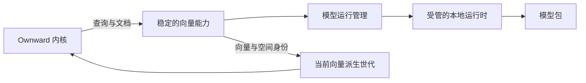

# 向量能力架构

本文规定向量模型进入 Ownward 的产品形态、能力边界和生命周期。具体模型、运行时与进程通信方式可以演进，但不能改变本文规定的关系。

## 产品判断

**Ownward 不应绑定一个模型，而应拥有一套完整的本地向量能力；EmbeddingGemma 是这套能力经过验证的第一代实现。**

用户安装并使用的是具备语义检索能力的 Ownward，不应负责选择模型、配置接口、提供密钥或启动模型服务。模型与核心程序可以作为独立制品维护，但必须由 Ownward 统一交付、校验、运行和升级。

## 整体结构

| 部分 | 职责 |
| --- | --- |
| Ownward 内核 | 使用向量信号参与召回和证据融合，并对最终检索质量负责。 |
| 向量能力 | 分别生成查询和文档的语义表示，屏蔽具体模型、运行时与通信方式。 |
| 模型运行管理 | 管理模型包的安装、完整性校验、启动、健康、停止和升级。 |
| 本地运行时 | 在用户设备上完成向量计算，不承担信息组织、关系推导和检索编排。 |
| 向量派生世代 | 保存与当前资产版本和向量空间一致的可重建向量。 |

向量能力与[语义理解能力](../semantics/README.md)必须相互独立。前者在本地生成语义表示并召回候选，后者通过可替换的外部能力理解开放内容并提出带依据和不确定性的关系与场景判断；两者都不形成信息权威，也不能替代 Ownward 内核。第一版可以由接入的外部智能体兼任语义能力。

## 向量空间

一套向量空间由模型制品、运行时行为、查询与文档提示、分词与截断、池化、维度截取、归一化、输出维度和数据类型共同确定。每套配置必须具有稳定身份，并随向量持久化。

查询向量只能与同一空间生成的文档向量比较。任何会改变向量含义或可比性的配置变化都形成新空间，不得把新旧向量混入同一索引，也不得以模型名称相同推定彼此兼容。

## 向量能力世代

模型文件、运行时、完整向量空间定义、对应的向量派生世代和索引共同构成一个一致性边界。它们可以作为独立制品和状态分别维护，但必须以同一能力世代对齐；内核只能使用已经完整生成并通过验证的一组能力，不得组合新旧世代的模型、向量或索引。

## 交付与运行

模型包是 Ownward 的运行资产，不是用户信息资产。第一版正式发布包直接携带经过验证的模型和平台运行时，使用户安装 Ownward 后无需另行下载或配置即可使用完整向量能力。Ownward 自有代码与第三方制品保持清晰的许可边界；组包与发布必须校验 Gemma 完整条款、用途限制、`NOTICE`、修改说明及运行时许可证与所分发模型的对应关系，产品运行只校验模型、推理运行时和向量空间等技术制品，不生成或依赖逐安装确认状态。用户备份不携带模型、运行时或向量索引，这些内容必须能够从正式制品重新取得和重建。

第一版由 Ownward 管理一个私有的本地 llama.cpp 子进程。进程通信只服务本机 Ownward，不成为对外契约；内核只依赖向量能力，不感知 llama.cpp 的接口。模型在连续使用期间可以保持就绪，空闲释放策略由实际启动延迟、内存和使用体验共同确定，不得为减少表面常驻占用反复支付冷启动成本。

模型不可用时，信息仍须先可靠进入长期资产；相应向量状态保持待生成，稳定身份读取和不依赖向量的检索能力继续工作。不得用与正式向量空间不兼容的替代结果冒充成功。

## 升级与恢复

模型、运行时或向量空间升级时，在不改变长期信息资产的前提下建立新的向量能力世代，由确定版本的模型与运行时、完整空间定义、向量派生状态和对应索引组成。旧世代在新世代准备期间继续工作；新世代完整生成并通过质量、完整性和资源验证后，查询路径才能整体原子切换。准备、验证或切换失败时撤销新世代并继续使用上一个有效世代；切换稳定后再回收不再使用的旧模型、运行时、向量和索引。

因此，Ownward 掌握的是向量能力、空间定义和生命周期，而不是某一代模型实现。未来替换模型、运行时或硬件加速方式时，信息资产、统一能力契约和检索体系不需要随之重写。

---

## 第一版架构落点

第一版采用 [EmbeddingGemma 300M 的 Q8 GGUF 方案](../../research/vector-model-selection.md)：CPU-only、llama.cpp、2 个推理线程，使用官方查询与文档提示、Mean Pooling 和 L2 归一化，将 768 维输出截取为 512 维后重新归一化。

第一版必须完成：

1. 将本地向量能力从同时承担内容理解和向量生成的模型接口中分离，向内核分别提供查询向量与文档向量。
2. 以完整配置生成向量空间身份，并使派生记录、索引和重建过程能够拒绝不兼容向量。
3. 由 Ownward 管理模型包和本地运行进程，不要求用户配置模型服务或密钥，不把模型接口暴露为产品契约。
4. 在正式发布包中完整交付模型与运行时，并正确包含第三方条款、`NOTICE`、修改说明和许可证，使全新环境安装后能够合规、开箱即用。
5. 保证信息写入不依赖向量生成成功，并建立待生成、重试、重建和世代切换的完整故障边界。
6. 使用最终交付形态重新验证向量一致性、检索质量、启动与热查询时效、内存、存储和异常恢复；选型阶段的独立测试不能替代集成验收。

第一版不建设模型市场、多模型调度或通用插件体系；可替换性通过稳定能力边界和安全世代迁移获得，而不是通过预建需求之外的功能获得。

## 依据

- [产品需求](../../product/requirements.md)
- [架构总纲](../../architecture/overview.md)
- [检索体系演进](../retrieval/README.md)
- [语义理解架构](../semantics/README.md)
- [存储架构](../storage/architecture.md)
- [向量模型方案](../../research/vector-model-selection.md)
- [第一版交付定义](../../delivery/first-version-delivery-definition.md)
