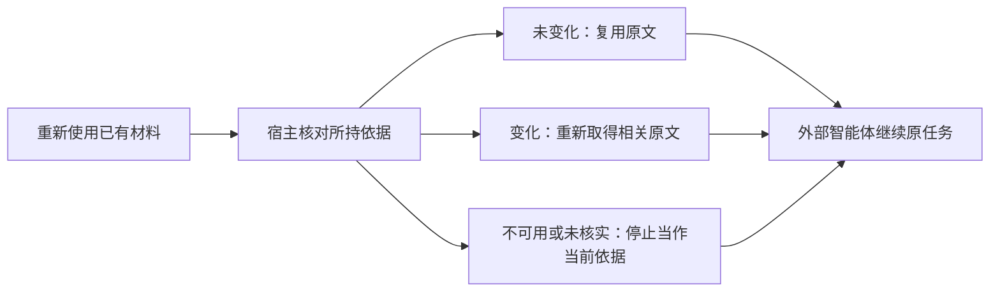

# 信息变化架构

产品行为以[信息随用户变化](../../product/information-change.md)为准；本文规定实现契约，设计、实现与验收状态由[工作包三](../../tasks/information-control-and-change.md#工作包三信息随用户变化)维护。

## 核心选择

**变化含义留在用户资产中，来源是否变化由确定性能力核对，何时核对及如何继续任务由外部智能体与宿主协作。** 沿用现有更新、证据和关联刷新能力，补充可携带的依据引用与按需批量核对；不新建语义时间数据库、变化事件平台或模型判断链。

| 层次 | 职责 |
| --- | --- |
| 外部智能体 | 理解更正、现实变化和适用条件，形成忠实的保存内容；评估当前任务需要哪些依据，针对变化重新判断。 |
| 宿主适配 | 自动保留材料与依据的对应关系，在接续和重新使用时发起核对，将失效结果带回原任务；不解释开放语义。 |
| 统一产品能力 | 提供来源绑定的读取与核对结果，执行同一主体的权限和停止使用检查。 |
| 权威基座与信息内核 | 保持资产身份、条件更新和耐久提交；按现有机制使旧证据、旧派生失效并刷新相关组织。 |

## 变化如何保存

继续使用资产的正文、来源、场景、明确关系及既有创建、更新契约；不为“纠错”“搬家”“计划变化”等场景添加专用字段或硬编码分支。

1. 智能体先取得相关原文及当前版本，再形成完整的更新内容。纠错保留正确含义；现实变化同时保留仍有用的历史事实与明确适用条件；未知的时间或因果关系不补造。无关内容不得因一次修改被丢弃。
2. 原文属于需要保留的来源证据时，保留原文并保存明确的更正说明；更正附于同一资产或另存，都须按下方契约绑定原资料及说明原文。已明确的更正对象不能只交给派生语义关系重新猜测，也不能仅凭正文中出现更正就认为片段交付已完整。普通信息维护可以更新同一资产，不强制每次编辑产生一项历史资产。
3. 按 `ExpectedRevision` 提交；冲突后沿用原用户意图重新读取和组织修改，不盲目更换版本重发。写入成功与组织完成分别表达，沿用工作包二的操作回执处理响应丢失，不重复沉淀。
4. 语义理解仍经现有协作路径完成；规则只补齐“保存变化含义”和“旧材料按需核对”的通用约定，融入已有主动沉淀、可靠应用条款，不叠加场景清单或另设复核角色。

保存有用历史依靠当前资产中明确保留的内容，不能依赖压实后可能消失的旧日志。`ReadVersion` 目前只核对当前版本，并不是历史版本读取接口。

### 明确更正随来源交付

更正统一使用 `ExplicitRelation` 的 `qualifies` 关系：目标为受说明影响的原资产，来源为保存说明的资产；正文保留具体含义、对应原文和适用条件。关系表示“使用目标时须考虑这份说明”，不表示较新的内容自动为真；纯模型猜测仍属于派生线索。

| 保存方式 | 明确说明的定位 |
| --- | --- |
| 另存说明 | 关系指向原资产；说明占整项资产时直接读取，位于长资料内部时定位说明原文。 |
| 同一资料内附加说明 | 关系指向本资产，并必须定位说明原文；原始发言保持原样，任何片段读取都能发现这份说明。 |

定位采用可唯一匹配的原文引用，必要时附相邻原文消歧；智能体提供文字，服务验证并生成当前版本的读取范围，不让智能体计算字符偏移。引用仅用于寻址，事实仍以资产原文为准。CLI/MCP 共用维护权限、目标校验及正文与关系的同次条件提交；编辑后重新校验定位，失配或歧义时拒绝这次提交，由智能体修正更新，不能沿用旧范围或静默丢弃说明。自指仅允许带有效说明定位的 `qualifies`，不扩展为任意自关联。

全文与片段读取都返回同一套说明定位及覆盖状态，与相关度排序无关：已交付内容完整包含某条说明时标为已覆盖，否则保留待读入口。首次读取当前版本与旧材料重读采用同一行为；全文指纹只能证明来源状态，不能代替取得说明。外部智能体核验与当前用途有关的说明，不能把未读当作无影响。新增更正直接关联实际影响的原资料，不依靠无限追溯更正链；不明确影响对象的新信息仍走正常检索。

内核从当前资产的明确关系建立可重建反向索引，统一包含本资产与其他资产中的说明。引用同时绑定原资产状态与直接说明集合的指纹；说明的新增、修改、移除都会使所持依据变为 `changed`，即使原正文和修订没有变化。集合指纹取说明的来源身份、内容指纹与定位，不递归引用说明自身的 `basis`，自指不会产生循环计算。索引更新与资产提交的可见性保持一致，不等待语义整理；重建期间不得返回假的 `unchanged`。核对只访问目标及其直接说明，不扫描全库。

说明遵循同一读取权限、遗忘和恢复边界；不可取得时不泄露内容，也不能把说明消失理解为原说法重新成立。外部智能体按当前可用依据重新判断。该索引与集合指纹均可由资产重建，不形成第二份权威关系或历史库。

### 相对时间保持原意

智能体保存含相对时间的内容时，将来源已知的表达时点及必要时区写入当前资产的来源说明或正文，并保留原表达；能够明确换算时可同时注明对应日期，不能提高来源本身的精度。宿主有真实消息时间时一并提供，导入资料采用资料的表达时间；Hook 执行时间及 `CreatedAt`、`UpdatedAt` 不能冒充表达、事件发生或生效时间。

以后更新无关内容、迁移或重新读取不得移动这一参照。参照缺失时保持未知，不用服务当前时间补齐；仅在它影响当前结果时由智能体澄清。内核负责保存和交付，时间含义仍由外部智能理解，不增加时态推理引擎。

## 可携带的依据

正式全文读取与证据读取在原有结果旁增加不透明的 `basis` 引用。原 `information`、`evidence` 及其字段保持可用；引用是产品交付元数据，不进入长期资产正文、组织索引或授权凭据。

引用由服务根据**这次实际交付的同一份读取快照**生成，绑定引用格式、体系身份、资产身份、修订、完整资产的内容指纹及直接说明集合指纹；片段继续携带既有证据范围。指纹采用固定序列化与 SHA-256；集合按说明来源、内容指纹及定位排序计算，不混入地址、宿主、模型或派生世代。不能先取正文、再另取可能已经变化的版本或说明集合为正文贴标签。

版本负责普通变更识别，指纹防止旧备份恢复后分支再次达到相同版本号，却有不同内容。即使片段文字没改，来源其他部分或明确语义发生变化也要重新判断，不能只验证片段字节。

引用只标识来源状态，不扩大实际阅读范围；取得一个片段的引用不等于已经阅读整项资产。

完整资产指纹可作为随资产更新和回放重建的内存元数据复用；不扫描全库，不为核对生成向量或调用模型，也不增加一套持久历史。旧引用没有足够身份时不得补造“已核对”依据。

## 按需核对契约

增加读取权限下的 `CheckInformation` 能力，对外工具名为 `ownward_check`；输入为一批实际取得的 `basis`，输出按输入对应的结果。内核只比较当前权威资产；所有适配调用同一产品能力，不各自实现检查算法。

| 结果 | 准确含义 | 后续处理 |
| --- | --- | --- |
| `unchanged` | 该项来源在核对时仍与所持依据一致。 | 可复用已有原文；适用性和是否缺少新依据仍由智能体判断。 |
| `changed` | 来源仍可读，但版本、内容或直接说明集合已经变化。 | 返回变化来源及说明的定位；重新读取受影响来源，并取得当前用途所需的说明。 |
| `unavailable` | 在当前授权下，来源已不能取得。 | 停止依赖该材料，不返回旧正文或通过细分错误泄露受限信息。 |
| `unverifiable` | 引用缺失、格式不受支持或不属于当前体系。 | 重新定位并读取；不能将未知当作未变化。 |

服务失联、取消、权限撤销及迁移中不可服务作为调用失败处理，不能伪造逐项成功。批量请求按传输容量有界处理；分批、缺项和失败均保留未完成状态，未收到结果的项不能视为已核对。核对不返回未变正文，不自动触发语义整理，也不替智能体判断哪个结论正确。

`changed` 只给出补取定位，不把旧正文换上新的依据；新 `basis` 随实际读取的当前来源交付。引用中的说明集合只证明已列出哪些来源，不证明已经读过；宿主分别保存原文和说明的实际阅读状态，不能以取得新 `basis` 代替补读。

每项读取遵循当前权威的一致性规则，返回逐项观测结果，不承诺整个任务或多次调用处于同一个冻结快照。检查和结果交付须经过既有权限、遗忘屏障及活动资格复核；依据引用不是授权，也不能绕过撤销。

## 宿主如何沿用材料

宿主保留材料的原文、`basis` 和原任务；记录属于宿主任务状态，沿用其已有恢复机制，不在 Ownward 建立智能体工作数据库。交接只携带接收方获准使用的材料或来源引用，接收方按自己的授权核对，不能继承发送方权限。

- **触发边界：** 中断恢复、任务交接、再次将旧材料用于新的判断或行动。宿主在已知边界自动核对下方工作集内的依据；集合外的旧材料和只有智能体知道的新用途，通过相同工具按需核对。没有旧依据时不请求检查，刚取得的材料不立即再查；不在每次工具调用前统一增加检查。
- **结果进入任务：** 变化状态先加入待继续的上下文，失效材料及其依赖结论不再作为已确认依据；外部智能体在原来的任务调用中重新判断，保留无关成果。对宿主控制的材料集移除已不可用内容，不承诺抹除历史对话或其他系统中的副本。
- **新材料与适用性：** 已明确绑定的说明随来源核对，不依赖搜索命中；未明确关联的新信息不在这一保证内。若任务依赖当前状态、完整汇总或“没有相关信息”的判断，在复用边界按当前目的重新检索必要线索。来源未变仍可能随时间改变适用性；复用未变正文，仅补相关新来源，不建立全库变化游标或声称能够确定性识别所有语义影响。
- **并发边界：** 重新取得信息后以新引用继续；再次变化则仍待核实，不无限循环重启。外部行动的核对尽量靠近执行，核对之后发生的新变化不在本次保证内；Ownward 不持有跨模型、网络或外部行动的长事务。

仅保存 `id/content` 的旧任务、没有来源的笔记和模型生成的结论都不能凭空获得依据。恢复时保留其工作价值，但需重新取得支撑当前使用的原文；已持有完整引用的工作不因此重跑。

### 自动核对的材料工作集

自动核对维护**有容量上限且会退出的近期材料工作集**，不把整段对话的阅读历史永久纳入检查。引用数量、元数据字节及无实际使用的保留轮数采用接入包固定预算，不随历史长度增长，也不交给用户配置；它只限定自动跟踪量，不限制任务能够使用的信息量，也不改变内核的读取权限或质量标准。

| 时机 | 工作集处理 |
| --- | --- |
| 实际读取或显式核对材料 | 加入或刷新对应引用与使用顺序；同一依据去重，保留实际读取范围。取得新版本不等于已经更新其他旧片段。 |
| 替换材料、任务结束或释放材料 | 移除不再沿用的引用；任务暂停仍保留。宿主提供明确任务事件时直接处理，不把普通回复结束当作任务结束。 |
| 容量已满或持续未使用 | 超容量时淘汰最久未使用的引用；超过有限任务轮次窗口仍无实际使用的引用也退出。只有新一轮用户任务推进窗口，恢复和压缩不额外计数；自动检查既不刷新使用顺序，也不续期。无需猜测自然语言是否意味着任务完成。 |
| 恢复任务或再次使用退出集合的材料 | 有依据则显式核对并重新纳入，无依据则重新读取；过去的成功检查不是持续有效的许可，不重跑无关工作。 |

核对结果只声明本次实际覆盖的引用及未完成项，不宣称整个会话已经有效；未覆盖材料统一按“使用前待核对”处理。按现有协议容量分批，但只处理固定工作集，不自动扫描归档或补查所有被淘汰项。失败与取消保留未核实状态，不在原调用内反复重试；无关任务无需等待历史材料补查。

Codex 适配以成功读取或智能体显式核对更新使用顺序，自动 Hook 核对不算使用；宿主无明确任务结束事件时采用上述容量与未使用轮数淘汰。压缩不重建全历史引用，清空任务上下文时清空工作集；重入旧材料仍遵循同一核对规则。工作集及待核实状态属于可清理宿主元数据，不新增任务数据库或模型判断步骤。

### 不同宿主的接入

统一工具可被具有工具调用能力的智能体显式使用；自动接续需要宿主适配识别任务边界、保存来源并注入核对结果，连接 MCP 本身不代表这些行为自动成立。

第一版在已有[信息使用接入](../information-use/README.md)中加入确定性核对步骤，正式交付 Codex 接入包：统一包装现有 MCP 连接、协作规则和轻量原生 Hook 适配，使用发布制品，不依赖开发仓库、测试脚本或开发机固定路径。安装时检查宿主能力并引导其正常扩展信任；启用后自动工作，不覆盖用户其他配置，也不要求另开 App Server 包装程序。

宿主接入点接受原任务的材料及依据、既有工具调用函数，返回逐项状态与需补取的来源；在把旧材料送回智能体前执行。没有旧材料时直接沿用现有流程；发生变化时，将结果合入下一次本就需要的任务调用，由智能体使用现有读取、检索工具补取。它不在连接器内猜测所有对话的任务边界，不另建调度器，也不自动重新执行任务准备或已完成的无关步骤。

Codex 插件随 Windows 发布包交付，安装方式见[项目使用说明](../../../README.md#codex-integration)。插件使用原生 `mcp_tool` Hook 调用已连接的 `ownward_host_event`，此工具仅属于宿主连接器，不进入内核契约。沿用原主体进行核对，不另起模型、连接或调度器。插件启用后仍需完成宿主的正常信任确认，不解析对话文件。[官方 Hook 契约](https://learn.chatgpt.com/docs/hooks)。适配如下：

| 接入点 | Ownward 适配职责 |
| --- | --- |
| `PostToolUse`，仅匹配本接入包的 Ownward 读取与显式核对工具 | 维护有界工作集、实际阅读状态与使用顺序，按宿主会话、体系和连接主体隔离；不复制原文、不解析推理或任意终端输出。 |
| `SessionStart` 的恢复、压缩，以及 `UserPromptSubmit` 的新一轮任务 | 只核对工作集内的旧依据，在下一次正常模型调用前交付覆盖范围、变化及补取定位；空集合直接返回。`clear` 清空工作集。 |
| 智能体已知的新用途、显式任务交接 | 携带来源引用并使用同一检查工具；接收方重新按自己的授权核对，不继承原授权。 |

接续记录存于宿主侧可清理的会话元数据；丢失时降为未核实并重新取得依据，不扫描历史对话猜补。核对沿用当前连接及其主体权限，不读取管理凭据；失败只影响依赖未核实材料的工作，不能报告“全部有效”或在后台无限重试。工具结果中的资产文本仍是数据，不作为 Hook 指令执行或提权注入。

工作集采用32条引用、64KiB元数据和8轮未实际使用的保留窗口，包含实际片段范围；只保存引用和状态，不复制原文。状态按宿主会话、体系与主体隔离，保存在系统用户缓存目录。Codex 恢复事件发生时若 MCP 尚未就绪，宿主会显示 Hook 失败，下一次用户输入在连接就绪后核对；未完成前仍不能复用为当前依据。未信任或不支持 Hook 的宿主仅具有显式工具能力，不宣称自动接续。

验收必须通过普通 Codex 安装和使用路径，实测记录依据、跨轮变化、恢复及重新读取的完整闭环，并验证未信任或不兼容时准确说明能力未启用；模拟 Reader 和手动调用辅助函数均不能替代。长时间单轮内部的新用途仍由智能体显式核对，不承诺拦截宿主不可观察的全部行动。

## 与已有能力共同工作

| 条件 | 必须保持的行为 |
| --- | --- |
| 普通重启、换地址、计划性迁移 | 相同资产仍可核对；引用不绑定进程或地址，迁移保留资产与体系身份，不全量失效已有材料。 |
| 旧备份恢复 | 沿用旧凭据失效契约；重新授权后也要核对材料。相同版本号但指纹不同仍是变化；说明集合变化同样使依据失效。无法从快照找回的新资料不能因重新检索而冒充已恢复。 |
| 授权撤销、遗忘 | 使用同一权限及删除屏障。核对不保留原文副本、不恢复已删除资产、不延缓停止使用；失败时不能静默退回旧缓存完成当前任务。 |
| 关联待组织、派生重建 | 复用已有版本失效和来源约束，区分原文与派生线索；原文未变不表示过去的推断已被再次证实。重建派生不改变原文身份。 |
| 压实、备份和替换内核 | 保留资产及明确含义即可重建检查所需元数据，不永久保存全部旧正文、依据回执或变化事件。 |

## 实现边界与验收依据

在统一契约中增加依据和检查能力，由受授权产品入口交付；核心与资产端口继续提供当前读取和条件提交。全文、片段必须共享引用生成和验证逻辑，CLI/MCP、远程适配及宿主集成使用同一语义；保持旧读取结果字段和旧证据路径兼容，新增能力随契约及组合清单明确声明，不以兼容为名返回假的核对结果。

新增工作限定为明确说明关系的保存与读取交付、读取依据、批量检查、正式宿主接续及必要规则说明。时间参照通过现有资产表达保存；不预建时态数据库、永久事件流、订阅推送、全库缓存或通用宿主控制框架。

验证同时覆盖两条链：用户表达变化→忠实保存→后续正确使用；持有旧材料→核对→补取或停止依赖→原任务接续。具体场景与结束条件见[第一版交付定义](../../delivery/first-version-delivery-definition.md#信息随用户变化)和[工作包三专项审查](../../tasks/information-control-and-change.md#工作包三专项审查)。
