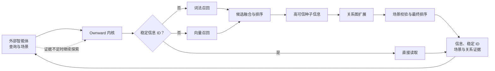

# 检索体系演进

本文维护 Ownward 检索体系长期成立的原则、能力职责及各版本的实际编排与验证结论。

## 体系原则

- 多种检索证据由统一内核管理，具体查询可以选择最合适的组合路径；任何单一模型、索引或关系结构都不能成为信息权威。
- 内核负责组合证据并对检索质量与时效负责；外部智能体负责主动检索的方向选择、证据评估、继续或结束判断以及最终结果组织。
- 直接命中的信息证据优先，关系扩展只能补充和校准结果，不能依靠间接关联压过更强的直接证据。
- 检索编排、模型、索引和关系实现均可演进或替换，不得改变长期信息资产及其稳定身份。

## 能力职责

| 能力 | 职责 |
|---|---|
| 稳定身份与直接读取 | 已知信息身份时直接取得权威资产，不进入无意义的检索链路。 |
| 词法检索 | 召回准确名称、编号、术语及与原文高度一致的信息。 |
| 向量检索 | 召回表达不同但语义相近的信息，提供语义候选与相似度证据。 |
| 语义关系图 | 表达并导航信息之间的层级、归属、组成、依据、冲突及其他有价值关系。 |
| 场景 | 约束信息在当前项目、时间、环境或使用条件下是否适用。 |
| Ownward 内核 | 选择、组合、校准和排序全部检索证据，返回可继续探索的稳定信息结果。 |
| 外部智能体 | 根据使用目的发起检索，依据累计证据调整查询、读取信息、导航关系并判断结束。 |

## 版本维护规则

1. 文档顶部的当前版本指向正在采用的检索编排；形成新版本时更新该指向。
2. 版本记录只增不改。修正、替代或淘汰均追加新版本，不覆盖旧版本的设计、表现和结论。
3. 每个版本固定记录工作模式、相对变化、验证表现、适用判断和后续状态；无法形成这些信息的调整不构成新版本。
4. 版本优劣以同一候选上的检索质量、检索时效和资源成本证据判断，不以设计复杂度或新颖程度判断。

---

## 当前有效版本

> **V1｜混合召回与关系扩展**
>
> 状态：有效基线，尚未完成最优性证明。

## 版本记录

### V1｜混合召回与关系扩展

| 属性 | 内容 |
|---|---|
| 状态 | 当前有效基线 |
| 代码快照 | `6909d8b` |
| 已有证据 | 固定候选 `50238d0` 通过 v5 回归，关系图增加了正确关系证据 |
| 尚未证明 | 当前候选完整验收、固定专项表现、LongMemEval‑V2 公开成绩及相对其他编排的最优性 |
| 待接入能力 | EmbeddingGemma 本地向量方案 |

#### 工作模式

词法与向量是相互独立的召回证据；当前代码依次执行二者，但不存在“词法结果作为向量输入”或“向量结果作为词法输入”的依赖。二者以等权倒数排名融合，候选数量为返回数量的四倍且不少于二十条；排名最高的四条成为关系扩展种子。关系图从种子扩展一层，按种子得分与关系置信度补充候选或提供有限加权，随后统一进行场景校验、排序和截断。

向量能力不可用时退化为词法结果；关系能力不可用或被关闭时保留词法与向量融合结果。外部智能体也可以绕过通用搜索，按稳定身份直接读取，或从已知信息开始单独导航关系。

#### 版本判断

V1 是根据产品需求形成、经过固定回归持续修正的当前实现，不是唯一检索方案。不同查询可以采用直接读取、词法优先、向量优先、关系导航或混合检索；长期目标是让统一内核在不破坏稳定边界的前提下采用最适合当前查询的组合。

V1 已证明混合召回与关系扩展能够共同工作，固定候选 `50238d0` 曾通过 v5 回归并证明关系图增加了正确关系证据；该基线已经参与调优，且当前代码此后又发生语义组织修改，因此不能据此宣称 V1 已经最优或当前候选已经完成验收。最终选定的 EmbeddingGemma 本地向量能力也尚未接入 V1。

#### 后续验证

第一版完成前，必须在接入最终向量能力后，以同一候选版本完成内核前沿优化环、固定 Ownward 专项数据集和 LongMemEval‑V2 验证，同时比较检索质量、检索时效与资源成本。结果支持 V1 时补充其最终证据；只有现有证据无法收敛且具体替代方案可能改变完成结论时，才复用同一批固定材料执行最小定向对照。需要改变编排时追加 V2，写明相对 V1 的变化、验证表现与取代依据，不改写 V1。

## 依据

- [架构总纲](../../architecture/overview.md)
- [当前检索实现](../../../internal/core/service.go)
- [Ownward Acceptance Suite v1](../../../benchmarks/acceptance/suite/README.md)
- [关键工作留痕](../../records/work-log-0001.md)
